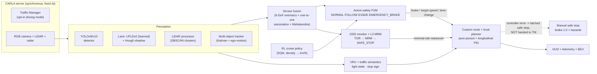
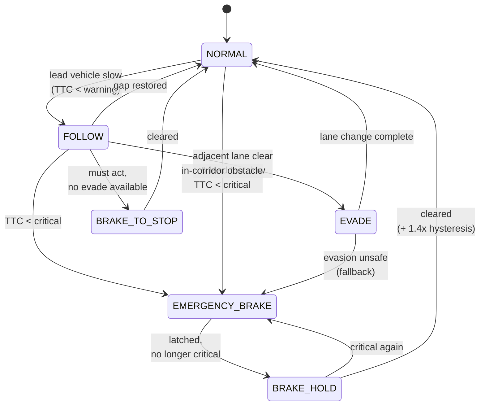

<div align="center">

# 🚗 CARLA ADAS — Perception → Fusion → Committed Active Safety

**A modular autonomous-driving perception and active-safety stack in the [CARLA](https://carla.org/) simulator, built around one production-ADAS principle: the emergency brake is a geometric check of the planned corridor against metric LiDAR and radar, not a detector output — so a missed or mislabelled detection cannot by itself suppress it. Perception labels the scene; geometry decides when to brake. (The corridor itself can come from the learned lane, so learned components are not out of the braking chain entirely.)**

[](https://www.python.org/)
[](https://carla.org/)
[](https://pytorch.org/)
[](https://github.com/ultralytics/ultralytics)
[](https://github.com/nhatduongchess-cloud/carla-adas-active-safety-project/actions/workflows/selftest.yml)
[](selftest.py)
[](LICENSE)

</div>

> **Portfolio project.** An end-to-end study of the perception → fusion → safety-decision loop at the core of every ADAS/AD stack, built solo in the CARLA simulator. It prioritizes correct fundamentals and honest verification over feature count. See [**Scope & status**](#scope--status) for exactly what is demonstrated versus in progress.

<div align="center">


*Live run in CARLA `Town10HD`. Left: camera with YOLO detections + lane overlay. Right: live ADAS dashboard. The clip walks the committed active-safety arbiter through three states — **`AEB: NORMAL`** (free-flow cruise, obstacle tracked at range) → **`AEB: BRAKE_HOLD`** (in-path hazard, TTC collapsing) → **`AEB: BRAKE_TO_STOP`** (ego brought to a full stop), all under `L3_ACTIVE` / `ODD:NORMAL`.*

</div>

---

## Table of contents
- [Highlights](#highlights)
- [Scope & status](#scope--status)
- [System architecture](#system-architecture) · [full architecture doc](docs/ARCHITECTURE.md)
- [Active-safety state machine](#active-safety-state-machine)
- [Features](#features)
- [Results](#results)
- [Known limitations](#known-limitations)
- [Tech stack](#tech-stack)
- [Repository structure](#repository-structure)
- [Getting started](#getting-started)
- [Testing](#testing)
- [Engineering notes & design decisions](#engineering-notes--design-decisions)
- [Roadmap / future work](#roadmap--future-work)
- [How this was built](#how-this-was-built)
- [Acknowledgments](#acknowledgments)
- [License](#license)

---

## Highlights

- **Geometry-first active safety** — the AEB decision is a metric LiDAR **swept path** aligned to the waypoint centerline, so the car brakes for in-path obstacles inside the LiDAR safety envelope (about 30 m ahead, ±10 m lateral, ground-height filtered) regardless of detector class (cones, debris, vehicles). Precisely: a detector miss or misclassification cannot *by itself* suppress a brake, because the trigger never reads detector output. It is not a guarantee that a brake is never missed — the geometric path still depends on valid LiDAR/radar returns, sensor synchronisation, visibility and the corridor geometry, and each of those can fail on its own.
- **Committed safety arbiter** — a finite-state machine with hysteresis and brake-as-fallback that removed brake↔evade oscillation and brakes to a stop rather than creeping toward a stationary obstacle; a latched brake is released only after a clear corridor is *observed*, never because LiDAR data went missing. The diagram below shows the main path; the implementation also emits `BRAKE_HOLD` and `BRAKE_TO_STOP`, and the complete machine is in [`docs/ARCHITECTURE.md` §7.3](docs/ARCHITECTURE.md#73-the-committed-state-machine).
- **Multi-sensor fusion** — YOLO semantics + LiDAR position + front-radar range/radial velocity, with 6-DoF extrinsics, one-to-one association and Mahalanobis track updates; ego-motion-compensated Kalman tracking.
- **Audited learned lane with deterministic fallback** — UFLDv2 (Tusimple, ResNet18) via a hash-pinned, weights-only local backend, gated by confidence/width/jump checks with junction priority and a CARLA-map fallback.
- **L3-style ODD / MRM layer** — an ODD monitor (`NORMAL / DEGRADED / VIOLATION`) and a `TOR → MRM → SAFE_STOP` state machine with a project-configured 10 s takeover window (driver takeover is a simulated flag, never a verified human), with a heuristic friction/stopping-distance model (a weather-weighted range-fusion helper exists and is unit-tested but is **not wired into the runtime**). "L3-style" means the *logic shape* of an SAE Level 3 fallback, simulated; it is not a Level 3 qualification, and friction/visibility are **modelled estimates** from CARLA weather parameters, not physical measurements.
- **Safety-capped RL cruise** — a lightweight DQN sets desired speed from traffic density but can *only* propose cruise speed; AEB/MRM always override.
- **Reproducible, CARLA-free verification** — `selftest.py` exercises the geometry + safety math in **210 checks** with no simulator running, so the safety logic is testable in CI.
- **Fail-closed runtime** — the pipeline reports success only after teardown is *verified* (owned actors removed, world settings restored, async progress confirmed); a failed or timed-out cleanup fails the run and its exit code.

## Scope & status

This is a **portfolio project**, scoped to demonstrate ADAS fundamentals honestly rather than to certify a production system.

**Demonstrated / working:**
- The full perception → fusion → safety → control loop in CARLA, driven by the custom planner/controller. Traffic Manager is an **opt-in** driving mode, not a fault handler: if the custom stack raises, the runtime latches `custom_fault_safe_stop`, brakes manually with hazards and explicitly does **not** hand the vehicle to autopilot (`modules/ego_control.py`).
- Committed AEB/evasion arbiter, radar ground-plane rejection, sensor fusion + tracking, learned-lane/map arbiter, ODD/MRM layer, RL cruise under a safety cap.
- 210 CARLA-free self-test checks and a 409-test unit suite (controller, safety, radar, junction, neural scheduling, dataset labels).
- A curated, seeded scenario harness for AEB/avoidance verification.

**Evidence discipline.** What each claim rests on is recorded in
[`docs/CLAIM_EVIDENCE_REGISTER.md`](docs/CLAIM_EVIDENCE_REGISTER.md), every metric is
defined in [`docs/METRIC_DEFINITIONS.md`](docs/METRIC_DEFINITIONS.md), and the
requirement status (implemented / unit-verified / simulation-observed /
known-failing) is in [`docs/REQUIREMENT_MAP.md`](docs/REQUIREMENT_MAP.md). The
2026-09-25 remediation and what it did not cover:
[`docs/EVIDENCE_REMEDIATION_RESULTS.md`](docs/EVIDENCE_REMEDIATION_RESULTS.md). The
code changes of that date have **not yet been run on the simulator**.

**In progress / future work** (see [Roadmap](#roadmap--future-work)): custom 8-class detector accuracy, a full 20k-frame dataset, the complete scenario × weather × fault matrix and soak, and native-engine stability on this custom build (see [Known limitations](#known-limitations)).

**Detection in the demo** uses pretrained COCO YOLO weights; a custom CARLA detector is future work.

## System architecture



**Design in one line:** the custom planner/controller drives by default; AEB and L3 MRM hold the highest-priority override, so safety always wins over comfort and over the learned cruise policy.

> 📐 **[Full system architecture → `docs/ARCHITECTURE.md`](docs/ARCHITECTURE.md)** — architectural drivers, execution model, per-tick sequence, the complete AEB state machine, command arbitration, the three containments on the RL policy, the freshness contract, verified teardown, the verification tiers, and an honest list of known architectural gaps. Every constant in it is referenced to the line of code it came from.

## Active-safety state machine



`EVADE` is `EVADE_LEFT` / `EVADE_RIGHT` in code. Full transition table, constants
and abort conditions: [`docs/ARCHITECTURE.md` §7.3](docs/ARCHITECTURE.md#73-the-committed-state-machine).

## Features

| Area | What it does | Key modules |
|------|--------------|-------------|
| **Perception** | Vehicle/VRU detection, learned + Hough lanes, LiDAR clustering, Kalman tracking | `object_tracking.py`, `learned_lane.py`, `lane_detection.py`, `lidar_processor.py`, `mot_tracker.py` |
| **Sensor fusion** | 6-DoF LiDAR→camera projection, one-to-one association, Mahalanobis updates, ego-motion compensation | `sensor_fusion.py`, `ego_motion.py`, `mot_tracker.py` |
| **Active safety** | Committed AEB/evasion arbiter with hysteresis, dynamic safe-distance & TTC | `active_safety.py` |
| **Planning/control** | Waypoint route intent, quintic lane change, pure-pursuit + PID control | `road_geometry.py`, `local_planner.py`, `ego_driving_stack.py`, `lateral_controller.py`, `longitudinal_controller.py` |
| **Traffic semantics** | VRU-aware margins, traffic-light state, stop-sign lifecycle | `object_tracking.py`, `traffic_light.py`, `scene_semantics.py` |
| **L3 / ODD / MRM** | ODD monitor, takeover request, minimal-risk maneuver, friction model | `odd_monitor.py`, `mrm_controller.py`, `friction.py`, `weather_model.py` |
| **Reinforcement learning** | Offline DQN cruise-speed policy under a hard safety cap | `rl_speed_controller.py`, `rl_agent.py`, `rl_env.py` |
| **Validation** | Seeded scenario library, KPI recorder & reports | `run_scenarios.py`, `scenario_library.py`, `kpi.py`, `l3_report.py` |
| **Runtime** | Orchestrator, bounded sensor rig, neural scheduler, fail-closed teardown, dashboard/telemetry | `chinh.py`, `modules/sensor_runtime.py`, `modules/neural_perception.py`, `modules/runtime_cleanup.py`, `modules/runtime_report.py` |

## Results

> **Reading these honestly.** Numbers below were measured on specific configurations and dates; each states its context. They are simulator results from a portfolio project, **not** certified ADAS metrics. Live runtime latency and full-capture stability on the current custom build are still being worked (see [Known limitations](#known-limitations)); results outside the current stable envelope are labelled as such.

### Scenario harness — re-run on HEAD, 2026-09-19

Against a live CARLA server (build `edf3e9f5c`, Town02, RTX 4070 Laptop) on the
current code. Reports in [`docs/benchmarks/`](docs/benchmarks/).

| Check | Observed | Target | Result | Artifact |
|---|---:|---:|:---:|---|
| Full catalog, 15 scenarios × 3 seeds | **43/45** | ≥43/45 | ✅ | [`head_catalog_3seed.json`](docs/benchmarks/head_catalog_3seed.json) |
| Core subset of that run, 6 scenarios × 3 seeds | **16/18** | 18/18 | ❌ | same file |
| **Overall acceptance gate** (core AND catalog AND no collision) | **FAIL** | PASS | ❌ | same file, `acceptance_gate.status` |
| Core suite × 5 weather profiles | **28/30** | 30/30 | ❌ | [`head_core_5weather.json`](docs/benchmarks/head_core_5weather.json) |
| Core suite, seed 42, clear | **6/6** | 6/6 | ✅ | [`head_core_seed42.json`](docs/benchmarks/head_core_seed42.json) |
| `DynamicObjectCrossing` diagnostic probes | **3/9** | — | diagnostic | [`head_doc_probe.json`](docs/benchmarks/head_doc_probe.json) |
| Collisions, all 90 runs (45 + 30 + 6 + 9) | **0** recorded | 0 | ✅ | all four files |
| Camera–LiDAR frame errors, all 90 runs | **0** | 0 | ✅ | all four files |
| Worst per-case perception p95 (catalog) | **132 ms** | ≤ 50 ms | ❌ | `head_catalog_3seed.json`, CPU inference |

The 90 runs overlap (the same recipes, seeds and weathers recur across files), so
they are **not** 90 independent situations, and "0 collisions recorded" is an
observation about those runs, not evidence that collisions cannot happen. These
reports predate the 2026-09-25 code changes (reaction metric v2, surface
clearance, evidence-based brake release); nothing has been re-run since.

The catalog sub-target is met; the acceptance gate as a whole is not, because it
also requires every core case to pass and two do not. An earlier version of this
table showed only the catalog row, which read as a pass.

Every failure is the same scenario missing the same single criterion:
`DynamicObjectCrossing` reacts in **1.225 s** against a 1.0 s budget. It brakes and
never collides. Its recorded clearance, minimum 4.26 m, was measured between actor
*centres* (see below), so the real gap between bumper and pedestrian is smaller — a
conservative estimate from the same data is about 1.5 m. Across seeds
it straddles the threshold in clear weather too (0.30 s / 1.225 s / 1.10 s), so it
is a marginal scenario rather than a weather effect, and it is **not** a regression
from the recent fixes: the same scenario on the pre-fix commit `47d9274` gives
identical numbers. See [Known limitations](#known-limitations).

**Why these numbers are lower than the 2026-09-01 ones below, and better.** The
older reports record `hazard_frame: null` and `reaction_delay_s: 0.0` for every
case: the harness had no hazard origin to measure from, so the reaction-delay
criterion could not fail. It measures properly now. Part of the old 45/45 and
30/30 was obtained with one of the five acceptance criteria inert — the numbers
above are the stricter ones.

**A second criterion was inert in every run published here, including the
2026-09-19 ones.** The minimum-clearance criterion (≥ 0.25 m) was fed the distance
between actor centres. Two cars of the ego's size touch at a centre distance of
about 4.8 m, so for a vehicle target the criterion could not fail. The smallest
value recorded anywhere, 4.04 m in `OppositeVehicleRunningRedLight`, is between two
cars. Clearance is now measured surface to surface between oriented bounding boxes
([`modules/clearance.py`](modules/clearance.py)); no published run used that yet,
so none of the verdicts above has actually tested clearance. The collision sensor
did, and recorded zero contacts in all 90 runs. Found by the 2026-09-25 evidence
review — see [`docs/benchmarks/README.md`](docs/benchmarks/README.md#evidence-review-2026-09-25).

All four HEAD runs used **CPU inference** (`inference_device: cpu`, the safe mode
chosen on Windows to avoid CUDA/D3D11 contention with the simulator).

### Scenario harness — earlier ground-filter build (2026-09-01, superseded)

Kept for contrast. Measured 2026-09-01 on the radar-ground-filter build, with the reaction-delay criterion inert as described above, so these are **not** the numbers to quote. Published at [`docs/benchmarks/`](docs/benchmarks/) rather than deleted, because the comparison is the point.

| Check | Observed | Target | Result | Artifact |
|---|---:|---:|:---:|---|
| Full catalog, Town02, 15 scenarios × 3 seeds | 45/45 | ≥43/45 | ✅ | [`catalog_clear_3seed_final_report.json`](docs/benchmarks/catalog_clear_3seed_final_report.json) |
| Core weather matrix, 6 scenarios × 5 profiles | 30/30 | 30/30 | ✅ | [`core_5weather_report.json`](docs/benchmarks/core_5weather_report.json) |
| Core suite, Town02, 3 seeds | 18/18 | 18/18 | ✅ | [`core_clear_3seed_report.json`](docs/benchmarks/core_clear_3seed_report.json) |
| Collisions / camera–LiDAR frame errors | 0 / 0 | 0 / 0 | ✅ | all three above |
| Max reaction delay / min clearance | 0.875 s / 4.04 m | ≤1.0 s / ≥0.25 m | ✅ | all three above — **both inert**: the delay had no hazard origin, and 4.04 m is centre-to-centre between two cars |

> The 2026-08-04 [`docs/scenario_baseline_report.json`](docs/scenario_baseline_report.json)
> (2/3 pass, 18 collision events) is kept deliberately as the earliest
> before-picture; it is superseded, not hidden.

### CARLA-free self-test

`selftest.py` → **210 checks / 0 failures**, run in CI on every push. Covers LiDAR→image projection, distance fusion, ego-motion tracking, TTC/safe-distance math, VRU/traffic semantics, planning/control, safety-FSM transitions, ODD/MRM, radar ground rejection/sign, and dataset gates. The unit-test suite adds **409 tests, all passing** (observed 2026-09-25 on the development machine, `python -m unittest discover -s tests -p "test_*.py"`). Of those, **306 need no CARLA client** and run in CI on every push; the other 103 are in six modules that import the CARLA client (no server needed) and stay local. Checks and tests are different kinds of count; they are not added together and are not a coverage figure.

### Live demo run — current stable envelope (2026-09-12)

A clear-road drive on the current custom build, in the stable envelope (Town02, clear weather, `low-memory` profile, `async-stable`, CPU inference, ego spawn-index 2):

| Metric | Value |
|---|---:|
| Distance driven | 121.5 m |
| Max speed | 35.8 km/h |
| Collisions | 0 |
| Frames captured | 887 (887 × 0.025 s = 22.2 s at the configured step; true simulated time was not recorded) |
| Loop rate | 20.0 frames / wall-second, **including teardown** — not a control-loop measurement; the report's `fps_ema` 44.9 is a HUD average and not a rate either |
| Frames commanding BRAKE | 310 of 887 (AEB active) |
| Run status in the report | **`FAIL`** |
| Teardown | **not verified** — ten `actor.destroy` steps failed, the rest unknown after the 20 s budget |
| Latency criteria | `safety_p99 ≤ 25 ms`, `perception_p95 ≤ 50 ms`, `inference_age_p95 ≤ 150 ms` — all three **not met** |

The custom controller tracked the route and reached the end location with zero
collisions, and the safety layer was doing real work: AEB commanded braking on
about a third of the frames. The run nevertheless **reports `FAIL`**, and that is
the honest headline: it ended early on the native engine fault (**B01**, see
[Known limitations](#known-limitations)), its teardown could not be verified, and
three latency criteria were missed. A clean drive with an unverified exit is a
failed run by this project's own rule — quoting the 121.5 m without the status
field would be quoting half a report.

Full artifact: [`docs/benchmarks/demo_clear.json`](docs/benchmarks/demo_clear.json),
with a field-by-field reading in [`docs/benchmarks/README.md`](docs/benchmarks/README.md).

**AEB and L3-MRM behaviour** are evidenced by the demo video clips plus the seeded scenario suite (`StationaryObjectCrossing`, `ConstructionObstacle`, `DynamicObjectCrossing`) and the `selftest.py` safety-FSM / ODD-MRM checks. A standalone live JSON report for those two clips was not reliably capturable: B01 is intermittent and can terminate a capture run before the report is written — itself a documented symptom of the limitation, not a gap in the behaviour.

### Empty-road false-AEB defect — a real bug, root-caused and fixed

Hands-on testing exposed a false positive: with zero traffic, AEB latched to a stop on an apparent obstacle at ~10.3 m. The front radar sits at 0.8 m with a 10° vertical FOV, so its lowest ray meets a flat road at ~9–10 m — those road-plane hits were entering tracking as stationary obstacles. `radar_processor.py` now rejects hits below a configurable ego-frame height *before* clustering. LiDAR still covers low debris, so AEB is not weakened; the HUD now names the winning threat source (`LIDAR`/`RADAR`/`TRACKER`). Locked in by regression checks in `selftest.py`.

## Known limitations

Honesty about limits is part of the engineering.

- **Native engine crash (B01) on heavy capture.** On the local custom CARLA build (`edf3e9f5c`, UE4 4.26.2), the fuller capture stack can trigger an intermittent native `EXCEPTION_ACCESS_VIOLATION` in skeletal-mesh scene-proxy render dispatch (`FSkeletalMeshSceneProxy` / `MeshObject`) during camera scene-capture. It has been reproduced across D3D11 and D3D12, `-onethread`, and low-render configurations; the available minidumps lack the heap needed to prove the object-lifetime root cause, and no matching native source/build tree is available to repair it. **Consequence:** demos and captures are scoped to a stable envelope (Low quality, 640×360, bounded runs). A full write-up is in [`docs/B01_FAILURE_ANALYSIS.md`](docs/B01_FAILURE_ANALYSIS.md).
- **An MRM brakes in a straight line, and an object inside the LiDAR near-field blind zone looks like a clear road.** Recorded as gaps G10 and G9 in [`docs/ARCHITECTURE.md` §12](docs/ARCHITECTURE.md#12-known-architectural-gaps). G9 is partly fixed (2026-09-25): missing LiDAR data no longer releases a latched brake, and holding no longer weakens it from 1.0 to 0.7; the blind-zone case remains. Neither change has been run on the simulator yet.
- **Takeover is simulated.** `--driver-takeover` is a flag; there is no manual input device and no verified human takeover. After the acknowledgement the configured controller keeps driving as a stand-in, and the AEB stays active.
- **`DynamicObjectCrossing` misses the 1.0 s reaction budget about half the time.** Measured on HEAD 2026-09-19: it reacts in **1.225 s** (49 frames), brakes and never collides — but it is late against the stated budget. Its recorded clearance was centre-to-centre, so how close it actually came is not yet measured. It straddles the threshold across seeds in clear weather (0.30 / 1.225 / 1.10 s) and is deterministic at 1.225 s in heavy rain. It is **not** a recent regression: the same scenario on the pre-fix commit `47d9274` gives identical numbers. It is the reason the current catalog score is 43/45 rather than 45/45. For this recipe the hazard origin defaults to the trigger frame (walker spawned ≈20 m ahead, trigger at 22 m, 1.6 m/s), so the 1.225 s could come from the oracle definition, warm-up, actor placement, the controller or perception — the evidence does not yet single out one, and the measurement used reaction metric v1. Evidence: [`docs/benchmarks/head_doc_probe.json`](docs/benchmarks/head_doc_probe.json) and [`pre_f02_doc_heavyrain.json`](docs/benchmarks/pre_f02_doc_heavyrain.json). Not yet diagnosed.
- **Detector accuracy is not qualified.** The demo uses pretrained COCO weights; a custom CARLA-domain 8-class detector is future work and does not yet meet an accuracy bar.
- **Runtime latency / throughput targets are aspirational**, not certified: on CPU-inference debug profiles the 20 FPS object / p95 latency targets are not met. Reported latency numbers state their profile.
- **Not a real-vehicle system.** This is a simulation study; it is not validated ADAS/L3 for a physical vehicle.

## Tech stack

**Simulation:** CARLA 0.9.14 / 0.9.15 / 0.9.16 · Traffic Manager · synchronous mode
**Perception & DL:** PyTorch · Ultralytics YOLOv8/v10 · UFLDv2 · OpenCV · scikit-learn (DBSCAN)
**Planning/Control:** finite-state safety arbiter · Kalman multi-object tracking · pure-pursuit + PID · pure-PyTorch DQN
**Tooling:** NumPy · PyYAML · Matplotlib · JSON/CSV KPI reporting

## Repository structure

```
Self-Driving-Perception/
├── chinh.py                 # Thin orchestrator — wires modules, owns lifecycle & fail-closed teardown
├── config.py                # Single source of truth: sensor geometry + safety thresholds
├── selftest.py              # CARLA-free self-test of geometry/control/safety (210 checks)
├── run_scenarios.py         # Seeded ScenarioRunner-style AEB/avoidance harness → JSON report
├── evaluate_l3.py           # Weather-profile L3 evaluation → JSON report
├── launch_carla.bat         # Server launcher + readiness gate
├── modules/                 # 75 domain modules (sensors, perception, radar, fusion, safety, control, L3, RL)
├── tests/                   # 24 unit-test modules; 18 of them run CARLA-free in CI
├── scripts/
│   ├── dataset/             # Capture, label review, audit and validation of the data-story sample
│   ├── training/            # YOLO / traffic-light / DQN training and model export
│   ├── demo/                # Demo runners (PowerShell) and the standalone perception pipeline
│   └── tools/               # Server readiness probe, smoke tests, manifests, replay benchmark
└── docs/                    # ARCHITECTURE.md, failure analysis, runbook, acceptance notes, benchmarks/
```

> **Not tracked in git** (see `.gitignore`): virtual environments, datasets, downloadable weights, runtime logs, telemetry CSVs, and vendored upstream repos (`scenario_runner/`, `ros-bridge/`, `rllib-integration/`, `transfuser/`).

## Getting started

### Prerequisites
- **CARLA 0.9.14 / 0.9.15 / 0.9.16** ([download](https://github.com/carla-simulator/carla/releases))
- **Python 3.12** (dedicated virtual environment recommended)
- **NVIDIA GPU with CUDA** for faster inference (developed on an RTX 4070 Laptop). CPU works but is slower; every published scenario run used CPU inference.

### Install
Verified configuration: **Windows 11 + PowerShell + Python 3.12 + CARLA 0.9.15**.
Other CARLA versions are listed above because the client API is compatible in
principle; they are **unverified here** — the wheel/client/server matrix has not
been tested for them.

```powershell
git clone https://github.com/nhatduongchess-cloud/carla-adas-active-safety-project.git
cd carla-adas-active-safety-project
py -3.12 -m venv .venvCarLa
.\.venvCarLa\Scripts\Activate.ps1
.\.venvCarLa\Scripts\python.exe -m pip install --upgrade pip
.\.venvCarLa\Scripts\python.exe -m pip install -r requirements.txt
.\.venvCarLa\Scripts\python.exe -m pip install carla==0.9.15   # must match the server
```

Everything below uses `.\.venvCarLa\Scripts\python.exe` explicitly rather than a
bare `python`, so the commands work whether or not the environment is activated.
For offline verification only, a much smaller set is enough and needs no CARLA
wheel: `python -m pip install -r requirements-selftest.txt`.
#### Detector weights — prepare them before the first run

Ultralytics *can* auto-download `yolov8n.pt`, but **this runtime forbids it**:
`modules/object_tracking.py` requires the file to exist locally, hashes it for the
provenance record, and if it is missing prints
`model weight missing; auto-download disabled` and continues **LiDAR-only**. That
degraded mode is reported in the log, the HUD threat source and the run report — it
is not a detector working silently, and geometry-only operation is not evidence of
working perception.

Fetch the pretrained COCO weight once, into the repository root (the path
`config.YOLO_MODEL_A` points at):

```powershell
python -c "from ultralytics import YOLO; YOLO('yolov8n.pt')"   # downloads to CWD
```

The trained DQN cruise policy is committed at `weights/rl_speed_policy.pt`, so no
preparation is needed for it; if it is absent the controller falls back to a density
heuristic and says so.

### Run (stable demo envelope)
```bash
# Terminal 1 — CARLA server, Low quality / 640×360
launch_carla.bat

# Terminal 2 — the ADAS pipeline (PowerShell; ` is the line continuation)
.\.venvCarLa\Scripts\python.exe -u chinh.py --town Town02 `
  --performance-profile low-memory --runtime-mode async-stable

.\.venvCarLa\Scripts\python.exe chinh.py --hazard          # stationary obstacle ahead (AEB demo)
.\.venvCarLa\Scripts\python.exe chinh.py --weather light_rain
.\.venvCarLa\Scripts\python.exe chinh.py --driver-takeover # simulate an L3 takeover request
```

## Testing

No CARLA, no GPU, no weights required:

```bash
python -m pip install -r requirements-selftest.txt
python selftest.py                 # 210 checks
python -m unittest tests.test_audit_training_dataset tests.test_carla_probe tests.test_dataset_labels \
  tests.test_decision_trace tests.test_image_quality tests.test_inference_telemetry tests.test_launch_carla \
  tests.test_neural_decoupling tests.test_perception_contracts tests.test_pipeline_metrics tests.test_runtime_cleanup \
  tests.test_runtime_config tests.test_runtime_report tests.test_safety_geometry tests.test_sensor_sync tests.test_validate_dataset \
  tests.test_evidence_review tests.test_evidence_remediation   # 306 tests
ruff check .
mypy
```

Requires a running CARLA server:

```bash
python run_scenarios.py            # curated seeded core suite → logs/scenario_test_report.json
                                   # exit 0 only on gate PASS (1 FAIL, 2 INVALID, 3 NOT_EVALUATED)
python run_scenarios.py --scenarios core --weathers clear,light_rain,heavy_rain,fog,storm
python -m unittest tests.test_capture_lifecycle tests.test_dataset_capture tests.test_ego_control \
  tests.test_junction_route tests.test_road_waypoints tests.test_sensor_runtime
```

GitHub Actions runs four gates on every push: ruff, mypy, `selftest.py`, and the
306-test offline group. The six CARLA-client modules stay local by necessity.

## Engineering notes & design decisions

- **Geometry over classification for braking.** The AEB trigger is a metric LiDAR swept path, not a detector confidence — a missed box cannot *by itself* cause a missed brake. Range sensing, synchronisation and corridor geometry remain in the path and can still fail.
- **Path-aware safety.** Obstacles are projected onto the upcoming waypoint polyline, not a fixed rectangle, reducing curve misses and off-path false positives.
- **Radar ground-plane rejection.** Radar hits are transformed to the ego frame and rejected below a configurable height before clustering — removing the 9–10 m ray/road false AEB without discarding vehicle returns.
- **Committed arbiter + hysteresis.** A committed decision with brake-as-fallback replaced frame-to-frame brake↔evade oscillation.
- **Don't creep into a stationary obstacle.** A "blocker" is classified by *obstacle* speed, not ego speed. A latched brake is released only after a clear corridor has been observed on valid LiDAR frames for 0.1 s; frames without valid data hold it at its latched level.
- **Learning is sandboxed.** The DQN only proposes cruise speed; it can never disable the safety layer — mirroring how comfort functions sit under the safety envelope in production ADAS.
- **One source of truth for calibration.** Every module reads resolution, FOV and sensor placement from `config.py`; an earlier resolution-mismatch bug that suppressed AEB motivated this.
- **Bounded asynchronous inference.** One latest-frame-only inference slot replaces queued stale work; every result carries a CARLA frame id and expires after 150 ms. Safety/control never wait on neural inference.
- **Fail-closed teardown.** The run reports success only after cleanup is verified; a timeout or failed restore fails the report and the process exit code, and never masks the original error. Scenario cases are finalised after their own cleanup, too.
- **One brake command, validated.** When an MRM and the AEB both ask to brake, the stronger request is sent; every command is checked for NaN and range before the RPC, and throttle is zero whenever the brake is applied.
- **No runtime model downloads.** A missing artifact produces an explicit provenance error and a geometry-safe fallback.

## Roadmap / future work

- [ ] Custom CARLA-domain 8-class detector with an accuracy bar and matched baseline comparison.
- [ ] Full reviewed dataset (duplicate/leakage resolution, eight-class coverage) beyond the demonstrator sample.
- [ ] Complete scenario × weather × fault matrix + 30-minute soak.
- [ ] Runtime performance qualification (unique-object throughput, end-to-end latency) on GPU.
- [ ] Native-engine stability investigation for the heavy capture path (B01).
- [ ] TensorRT/ONNX inference path with accuracy guardrails.

## How this was built

The project is mine — the problem, the scope, and the decisions about what to
build and what to leave out. I wrote it with AI assistance (Claude), which did
a large share of the implementation, debugging and documentation. The commit
history reflects that honestly: AI-assisted commits carry a co-author trailer.

What that leaves me responsible for, and what I can explain in detail:

- **The scope decisions.** The sensor set is deliberately capped. The
  development GPU is an 8 GB RTX 4070 Laptop, and adding further camera or
  LiDAR streams on top of the detector exhausts VRAM before it buys any safety
  margin. Additional modalities are future work, not an oversight.
- **Reading my own code critically.** Two of the defects fixed here I found by
  reading the source rather than by being told: a state-machine branch in
  `modules/planner.py` that could never be reached, and a missing minimum
  cruise floor in `modules/rl_speed_controller.py`. Both are recorded in
  [`docs/ARCHITECTURE.md` §12](docs/ARCHITECTURE.md#12-known-architectural-gaps).
- **Judging outside input.** An external review of this codebase proposed a set
  of changes. I evaluated them and applied the ones that held up, rather than
  applying the list.
- **The verification.** Every live number in this repository was produced on my
  machine against a running CARLA server. When a stricter harness dropped the
  catalog suite from 45/45 to 43/45, I published the lower number and the
  reason — see [`docs/benchmarks/`](docs/benchmarks/README.md) — instead of the
  flattering one.

Known open gaps are listed in
[`docs/ARCHITECTURE.md` §12](docs/ARCHITECTURE.md#12-known-architectural-gaps)
and are not hidden.

## Acknowledgments

- **[CARLA Simulator](https://carla.org/)** — the driving simulator and Python API.
- **[Ultralytics YOLO](https://github.com/ultralytics/ultralytics)** — object detector (AGPL-3.0).
- **[Ultra-Fast-Lane-Detection-v2](https://github.com/cfzd/Ultra-Fast-Lane-Detection-v2)** — learned-lane architecture/checkpoint (MIT).
- **[CARLA ScenarioRunner](https://github.com/carla-simulator/scenario_runner)** — scenario definitions that inspired the ported test recipes.
- The original perception-only pipeline this repo was seeded from ([mahinarshad28-glitch/Self-Driving-Perception](https://github.com/mahinarshad28-glitch/Self-Driving-Perception)); the CARLA integration, sensor fusion, active-safety FSM, L3 layer, RL controller and validation harnesses are original to this project.

## License

Released under the [MIT License](LICENSE). Some dependencies carry their own licenses (Ultralytics YOLO is AGPL-3.0) — review them before commercial use.

---

<div align="center">

**Author:** Duong Quang Nhat · nhatduongchess@gmail.com

<sub>A hands-on study of the perception → fusion → safety-decision loop at the core of every ADAS/AD stack.</sub>

</div>
