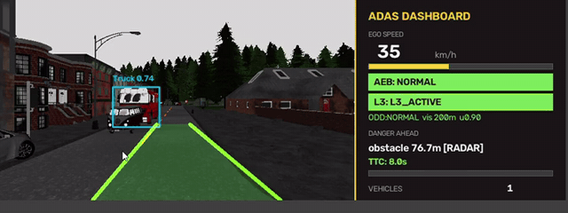
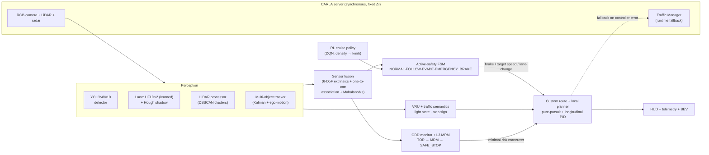
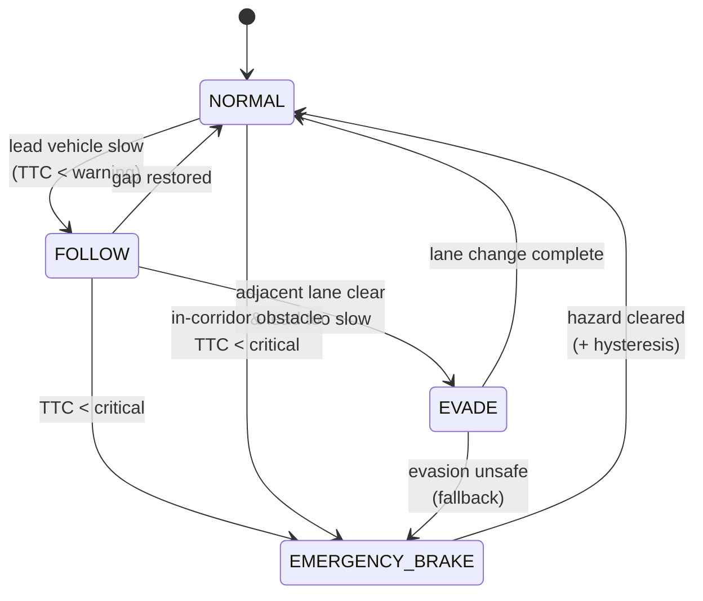

<div align="center">

# 🚗 CARLA ADAS — Perception → Fusion → Committed Active Safety

**A modular autonomous-driving perception and active-safety stack in the [CARLA](https://carla.org/) simulator, built around one production-ADAS principle: a metric, calibration-free braking corridor that no learned component is allowed to override. Perception labels the scene; geometry decides when to brake.**

[](https://www.python.org/)
[](https://carla.org/)
[](https://pytorch.org/)
[](https://github.com/ultralytics/ultralytics)
[](https://github.com/nhatduongchess-cloud/carla-adas-active-safety-project/actions/workflows/selftest.yml)
[](selftest.py)
[](LICENSE)

</div>

> **Portfolio project.** An end-to-end study of the perception → fusion → safety-decision loop at the core of every ADAS/AD stack, built solo in the CARLA simulator. It prioritizes correct fundamentals and honest verification over feature count. See [**Scope & status**](#scope--status) for exactly what is demonstrated versus in progress.

> _Demo: drop a recording at `docs/demo.gif` and it renders here._
> <!--  -->

---

## Table of contents
- [Highlights](#highlights)
- [Scope & status](#scope--status)
- [System architecture](#system-architecture)
- [Active-safety state machine](#active-safety-state-machine)
- [Features](#features)
- [Results](#results)
- [Known limitations](#known-limitations)
- [Tech stack](#tech-stack)
- [Repository structure](#repository-structure)
- [Getting started](#getting-started)
- [Testing](#testing)
- [Engineering notes & design decisions](#engineering-notes--design-decisions)
- [Roadmap / future work](#roadmap--future-work)
- [Acknowledgments](#acknowledgments)
- [License](#license)

---

## Highlights

- **Geometry-first active safety** — the AEB decision is a metric LiDAR **swept path** aligned to the waypoint centerline, so the car brakes for *any* in-path obstacle regardless of detector class (cones, debris, vehicles). A missed or late detection cannot cause a missed brake.
- **Committed safety arbiter** — a finite-state machine (`NORMAL → FOLLOW → EVADE → EMERGENCY_BRAKE`) with hysteresis and brake-as-fallback that removed brake↔evade oscillation and never creeps into a stationary obstacle.
- **Multi-sensor fusion** — YOLO semantics + LiDAR position + front-radar range/radial velocity, with 6-DoF extrinsics, one-to-one association and Mahalanobis track updates; ego-motion-compensated Kalman tracking.
- **Audited learned lane with deterministic fallback** — UFLDv2 (Tusimple, ResNet18) via a hash-pinned, weights-only local backend, gated by confidence/width/jump checks with junction priority and a CARLA-map fallback.
- **L3-style ODD / MRM layer** — an ODD monitor (`NORMAL / DEGRADED / VIOLATION`) and a `TOR → MRM → SAFE_STOP` state machine, with a friction/stopping-distance model and rain-aware fusion weighting.
- **Safety-capped RL cruise** — a lightweight DQN sets desired speed from traffic density but can *only* propose cruise speed; AEB/MRM always override.
- **Reproducible, CARLA-free verification** — `selftest.py` exercises the geometry + safety math in **179 checks** with no simulator running, so the safety logic is testable in CI.
- **Fail-closed runtime** — the pipeline reports success only after teardown is *verified* (owned actors removed, world settings restored, async progress confirmed); a failed or timed-out cleanup fails the run and its exit code.

## Scope & status

This is a **portfolio project**, scoped to demonstrate ADAS fundamentals honestly rather than to certify a production system.

**Demonstrated / working:**
- The full perception → fusion → safety → control loop in CARLA, driven by the custom planner/controller (Traffic Manager is a runtime fallback).
- Committed AEB/evasion arbiter, radar ground-plane rejection, sensor fusion + tracking, learned-lane/map arbiter, ODD/MRM layer, RL cruise under a safety cap.
- 179 CARLA-free self-test checks and an extensive unit-test suite (controller, safety, radar, junction, neural scheduling, dataset labels).
- A curated, seeded scenario harness for AEB/avoidance verification.

**In progress / future work** (see [Roadmap](#roadmap--future-work)): custom 8-class detector accuracy, a full 20k-frame dataset, the complete scenario × weather × fault matrix and soak, and native-engine stability on this custom build (see [Known limitations](#known-limitations)).

**Detection in the demo** uses pretrained COCO YOLO weights; a custom CARLA detector is future work.

## System architecture



**Design in one line:** the custom planner/controller drives by default; AEB and L3 MRM hold the highest-priority override, so safety always wins over comfort and over the learned cruise policy.

## Active-safety state machine



## Features

| Area | What it does | Key modules |
|------|--------------|-------------|
| **Perception** | Vehicle/VRU detection, learned + Hough lanes, LiDAR clustering, Kalman tracking | `object_tracking.py`, `learned_lane.py`, `lane_detection.py`, `lidar_processor.py`, `mot_tracker.py` |
| **Sensor fusion** | 6-DoF LiDAR→camera projection, one-to-one association, Mahalanobis updates, ego-motion compensation | `sensor_fusion.py`, `ego_motion.py`, `mot_tracker.py` |
| **Active safety** | Committed AEB/evasion arbiter with hysteresis, dynamic safe-distance & TTC | `active_safety.py` |
| **Planning/control** | Waypoint route intent, quintic lane change, pure-pursuit + PID control | `road_geometry.py`, `local_planner.py`, `ego_driving_stack.py`, `lateral_controller.py`, `longitudinal_controller.py` |
| **Traffic semantics** | VRU-aware margins, traffic-light state, stop-sign lifecycle | `object_tracking.py`, `traffic_light.py`, `scene_semantics.py` |
| **L3 / ODD / MRM** | ODD monitor, takeover request, minimal-risk maneuver, friction model | `odd_monitor.py`, `mrm_controller.py`, `friction.py`, `weather_model.py` |
| **Reinforcement learning** | Offline DQN cruise-speed policy under a hard safety cap | `rl_speed_controller.py`, `rl_agent.py`, `rl_env.py` |
| **Validation** | Seeded scenario library, KPI recorder & reports | `run_scenarios.py`, `scenario_library.py`, `kpi.py`, `l3_report.py` |
| **Runtime** | Orchestrator, bounded sensor rig, neural scheduler, fail-closed teardown, dashboard/telemetry | `chinh.py`, `modules/sensor_runtime.py`, `modules/neural_perception.py`, `modules/runtime_cleanup.py`, `modules/runtime_report.py` |

## Results

> **Reading these honestly.** Numbers below were measured on specific configurations and dates; each states its context. They are simulator results from a portfolio project, **not** certified ADAS metrics. Live runtime latency and full-capture stability on the current custom build are still being worked (see [Known limitations](#known-limitations)); results outside the current stable envelope are labelled as such.

### Scenario harness — curated AEB/avoidance suite (earlier ground-filter build)

Measured on an RTX 4070 Laptop with the radar-ground-filter code, before the current native-stability investigation. Reproduce with `run_scenarios.py`.

| Check | Observed | Target | Result |
|---|---:|---:|:---:|
| Curated core catalog, Town02 seed 42 | 6/6 | 6/6 | ✅ |
| Full catalog, Town02, 15 scenarios × 3 seeds | 45/45 | ≥43/45 | ✅ |
| Core weather matrix, 6 scenarios × 5 profiles | 30/30 | 30/30 | ✅ |
| Left/right cut-in, 2 scenarios × 3 seeds | 6/6 | 6/6 | ✅ |
| Collisions / camera–LiDAR frame errors | 0 / 0 | 0 / 0 | ✅ |
| Max reaction delay / min GT clearance | 0.875 s / 4.04 m | ≤1.0 s / ≥0.25 m | ✅ |

### CARLA-free self-test

`selftest.py` → **179 checks / 0 failures**, run in CI on every push. Covers LiDAR→image projection, distance fusion, ego-motion tracking, TTC/safe-distance math, VRU/traffic semantics, planning/control, safety-FSM transitions, ODD/MRM, radar ground rejection/sign, and dataset gates. The offline unit-test suite adds **280 tests, all passing**.

### Live demo run — current stable envelope (2026-09-12)

A clear-road drive on the current custom build, in the stable envelope (Town02, clear weather, `low-memory` profile, `async-stable`, CPU inference, ego spawn-index 2):

| Metric | Value |
|---|---:|
| Distance driven | 121.5 m |
| Max speed | 35.8 km/h |
| Collisions | 0 |
| Frames captured | 887 (~22 s simulated) |

The custom controller tracked the route and held speed with zero collisions. The run ended when the native engine fault (**B01**) fired at ~22 s — see [Known limitations](#known-limitations); the driving up to that point was clean. Report: `logs/demo_clear.json`.

**AEB and L3-MRM behaviour** are evidenced by the demo video clips plus the seeded scenario suite (`StationaryObjectCrossing`, `ConstructionObstacle`, `DynamicObjectCrossing`) and the `selftest.py` safety-FSM / ODD-MRM checks. A standalone live JSON report for those two clips was not reliably capturable: B01 is intermittent and can terminate a capture run before the report is written — itself a documented symptom of the limitation, not a gap in the behaviour.

### Empty-road false-AEB defect — a real bug, root-caused and fixed

Hands-on testing exposed a false positive: with zero traffic, AEB latched to a stop on an apparent obstacle at ~10.3 m. The front radar sits at 0.8 m with a 10° vertical FOV, so its lowest ray meets a flat road at ~9–10 m — those road-plane hits were entering tracking as stationary obstacles. `radar_processor.py` now rejects hits below a configurable ego-frame height *before* clustering. LiDAR still covers low debris, so AEB is not weakened; the HUD now names the winning threat source (`LIDAR`/`RADAR`/`TRACKER`). Locked in by regression checks in `selftest.py`.

## Known limitations

Honesty about limits is part of the engineering.

- **Native engine crash (B01) on heavy capture.** On the local custom CARLA build (`edf3e9f5c`, UE4 4.26.2), the fuller capture stack can trigger an intermittent native `EXCEPTION_ACCESS_VIOLATION` in skeletal-mesh scene-proxy render dispatch (`FSkeletalMeshSceneProxy` / `MeshObject`) during camera scene-capture. It has been reproduced across D3D11 and D3D12, `-onethread`, and low-render configurations; the available minidumps lack the heap needed to prove the object-lifetime root cause, and no matching native source/build tree is available to repair it. **Consequence:** demos and captures are scoped to a stable envelope (Low quality, 640×360, bounded runs). A full write-up is in [`docs/B01_FAILURE_ANALYSIS.md`](docs/B01_FAILURE_ANALYSIS.md).
- **Detector accuracy is not qualified.** The demo uses pretrained COCO weights; a custom CARLA-domain 8-class detector is future work and does not yet meet an accuracy bar.
- **Runtime latency / throughput targets are aspirational**, not certified: on CPU-inference debug profiles the 20 FPS object / p95 latency targets are not met. Reported latency numbers state their profile.
- **Not a real-vehicle system.** This is a simulation study; it is not validated ADAS/L3 for a physical vehicle.

## Tech stack

**Simulation:** CARLA 0.9.14 / 0.9.15 / 0.9.16 · Traffic Manager · synchronous mode
**Perception & DL:** PyTorch · Ultralytics YOLOv8/v10 · UFLDv2 · OpenCV · scikit-learn (DBSCAN)
**Planning/Control:** finite-state safety arbiter · Kalman multi-object tracking · pure-pursuit + PID · pure-PyTorch DQN
**Tooling:** NumPy · PyYAML · Matplotlib · JSON/CSV KPI reporting

## Repository structure

```
Self-Driving-Perception/
├── chinh.py                 # Thin orchestrator — wires modules, owns lifecycle & fail-closed teardown
├── config.py                # Single source of truth: sensor geometry + safety thresholds
├── selftest.py              # CARLA-free self-test of geometry/control/safety (179 checks)
├── run_scenarios.py         # Seeded ScenarioRunner-style AEB/avoidance harness → JSON report
├── evaluate_l3.py           # Weather-profile L3 evaluation → JSON report
├── collect_carla_dataset.py # Resumable CARLA capture (schema4) for the data-story sample
├── validate_dataset.py      # Dataset integrity / decode / label validation
├── modules/                 # Domain modules (sensors, perception, radar, fusion, safety, control, L3, RL)
└── docs/                    # Architecture, scope plan, failure analysis, acceptance notes
```

> **Not tracked in git** (see `.gitignore`): virtual environments, datasets, downloadable weights, runtime logs, telemetry CSVs, and vendored upstream repos (`scenario_runner/`, `ros-bridge/`, `rllib-integration/`, `transfuser/`).

## Getting started

### Prerequisites
- **CARLA 0.9.14 / 0.9.15 / 0.9.16** ([download](https://github.com/carla-simulator/carla/releases))
- **Python 3.12** (dedicated virtual environment recommended)
- **NVIDIA GPU with CUDA** for real-time inference (developed on an RTX 4070 Laptop). CPU works but is slower.

### Install
```bash
git clone <your-repo-url>
cd Self-Driving-Perception
python -m venv .venv && .venv\Scripts\activate      # Windows
pip install -r requirements.txt
pip install carla==0.9.15                            # match your server
```
Detector weights (`yolov8n.pt`) are pretrained COCO and auto-fetched by Ultralytics on first use. The trained DQN cruise policy ships in `weights/`, so the pipeline runs out of the box.

### Run (stable demo envelope)
```bash
# Terminal 1 — CARLA server, Low quality / 640×360
launch_carla.bat

# Terminal 2 — the ADAS pipeline
.\.venvCarLa\Scripts\python.exe -u chinh.py --town Town02 \
  --performance-profile low-memory --runtime-mode async-stable
python chinh.py --hazard         # spawn a stationary obstacle ahead (AEB demo)
python chinh.py --weather light_rain
python chinh.py --driver-takeover   # simulate an L3 takeover request
```

## Testing

```bash
python selftest.py                 # 179 CARLA-free checks
python run_scenarios.py            # curated seeded core suite → logs/scenario_test_report.json
python run_scenarios.py --scenarios core --weathers clear,light_rain,heavy_rain,fog,storm
```
A GitHub Actions workflow runs `selftest.py` on every push.

## Engineering notes & design decisions

- **Geometry over classification for braking.** The AEB trigger is a metric LiDAR swept path, not a detector confidence — a missed box cannot cause a missed brake.
- **Path-aware safety.** Obstacles are projected onto the upcoming waypoint polyline, not a fixed rectangle, reducing curve misses and off-path false positives.
- **Radar ground-plane rejection.** Radar hits are transformed to the ego frame and rejected below a configurable height before clustering — removing the 9–10 m ray/road false AEB without discarding vehicle returns.
- **Committed arbiter + hysteresis.** A committed decision with brake-as-fallback replaced frame-to-frame brake↔evade oscillation.
- **Never creep into a stationary obstacle.** A "blocker" is classified by *obstacle* speed, not ego speed, and the brake latch persists across brief LiDAR drop-outs so sparse obstacles can't release it.
- **Learning is sandboxed.** The DQN only proposes cruise speed; it can never disable the safety layer — mirroring how comfort functions sit under the safety envelope in production ADAS.
- **One source of truth for calibration.** Every module reads resolution, FOV and sensor placement from `config.py`; an earlier resolution-mismatch bug that suppressed AEB motivated this.
- **Bounded asynchronous inference.** One latest-frame-only inference slot replaces queued stale work; every result carries a CARLA frame id and expires after 150 ms. Safety/control never wait on neural inference.
- **Fail-closed teardown.** The run reports success only after cleanup is verified; a timeout or failed restore fails the report and the process exit code, and never masks the original error.
- **No runtime model downloads.** A missing artifact produces an explicit provenance error and a geometry-safe fallback.

## Roadmap / future work

- [ ] Custom CARLA-domain 8-class detector with an accuracy bar and matched baseline comparison.
- [ ] Full reviewed dataset (duplicate/leakage resolution, eight-class coverage) beyond the demonstrator sample.
- [ ] Complete scenario × weather × fault matrix + 30-minute soak.
- [ ] Runtime performance qualification (unique-object throughput, end-to-end latency) on GPU.
- [ ] Native-engine stability investigation for the heavy capture path (B01).
- [ ] TensorRT/ONNX inference path with accuracy guardrails.

## Acknowledgments

- **[CARLA Simulator](https://carla.org/)** — the driving simulator and Python API.
- **[Ultralytics YOLO](https://github.com/ultralytics/ultralytics)** — object detector (AGPL-3.0).
- **[Ultra-Fast-Lane-Detection-v2](https://github.com/cfzd/Ultra-Fast-Lane-Detection-v2)** — learned-lane architecture/checkpoint (MIT).
- **[CARLA ScenarioRunner](https://github.com/carla-simulator/scenario_runner)** — scenario definitions that inspired the ported test recipes.
- The original perception-only pipeline this repo was seeded from ([mahinarshad28-glitch/Self-Driving-Perception](https://github.com/mahinarshad28-glitch/Self-Driving-Perception)); the CARLA integration, sensor fusion, active-safety FSM, L3 layer, RL controller and validation harnesses are original to this project.

## License

Released under the [MIT License](LICENSE). Some dependencies carry their own licenses (Ultralytics YOLO is AGPL-3.0) — review them before commercial use.

---

<div align="center">

**Author:** Duong Quang Nhat · nhatduongchess@gmail.com

<sub>A hands-on study of the perception → fusion → safety-decision loop at the core of every ADAS/AD stack.</sub>

</div>
