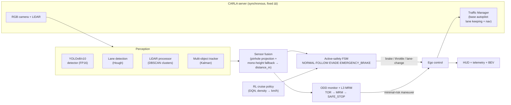
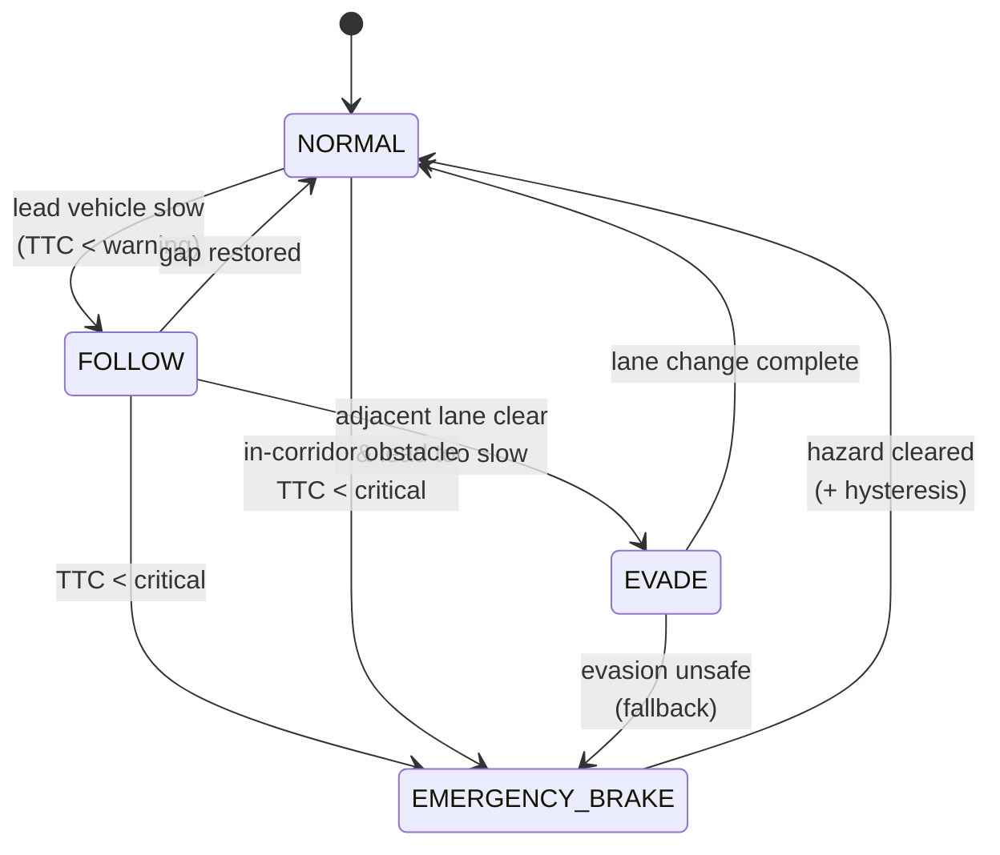

<div align="center">

# 🚗 CARLA ADAS — Perception-Driven Active Safety & L3 Automated Driving

**A modular autonomous-driving stack in the [CARLA](https://carla.org/) simulator: multi-sensor perception → sensor fusion → a committed safety state machine (AEB + evasive lane change) → an L3 "DRIVE PILOT"-style ODD/MRM layer, with a reinforcement-learning cruise controller and a portable scenario-test harness.**

[](https://www.python.org/)
[](https://carla.org/)
[](https://pytorch.org/)
[](https://github.com/ultralytics/ultralytics)
[](https://github.com/nhatduongchess-cloud/carla-adas-active-safety-project/actions/workflows/selftest.yml)
[](LICENSE)

</div>

> **What this is.** A learning + portfolio project that goes end-to-end from raw
> camera/LiDAR to a safe control decision, built around one principle used in
> real ADAS: **a metric, calibration-free braking corridor that no learned
> component is allowed to override.** Perception labels the scene; geometry
> decides when to brake.

> _Demo GIF placeholder — drop a recording at `docs/demo.gif` and it renders here._
> <!--  -->

---

## Table of contents
- [Highlights](#highlights)
- [System architecture](#system-architecture)
- [Active-safety state machine](#active-safety-state-machine)
- [Features](#features)
- [Tech stack](#tech-stack)
- [Repository structure](#repository-structure)
- [Getting started](#getting-started)
- [Usage](#usage)
- [Testing](#testing)
- [Results](#results)
- [Engineering notes & design decisions](#engineering-notes--design-decisions)
- [Roadmap](#roadmap)
- [Acknowledgments](#acknowledgments)
- [License](#license)

---

## Highlights

- **Multi-sensor perception** — a YOLOv8/v10 detector (optionally an ensemble, FP16 on GPU) for vehicles/VRUs, Hough-transform lane detection, and a LiDAR point-cloud processor with DBSCAN clustering.
- **Calibration-free AEB** — the braking decision comes from the **LiDAR forward corridor** (metric, in-lane), so the car brakes for *any* in-path obstacle regardless of detector class. Camera boxes are for labels/HUD, not for the brake trigger.
- **Committed safety arbiter** — a finite-state machine (`NORMAL → FOLLOW → EVADE → EMERGENCY_BRAKE`) with hysteresis and brake-as-fallback that removed the classic brake↔evade oscillation ("hesitation") and **never creeps into a stationary obstacle** (obstacle-speed blocker detection + brake-latch persistence).
- **L3 / DRIVE PILOT-style layer** — an ODD monitor (`NORMAL/DEGRADED/VIOLATION`), a takeover/minimal-risk-maneuver state machine (`TOR → MRM → SAFE_STOP`), a μ-based friction/stopping-distance model, and a rain-aware sensor-fusion weighting.
- **Reinforcement-learning cruise control** — a lightweight pure-PyTorch DQN sets the desired speed from traffic density (fast when clear, slow when busy), under a hard **safety-speed cap** (stop-in-gap + time-gap). It **only** proposes cruise speed; the AEB/MRM layer always overrides.
- **Repeatable validation** — a batch weather-profile harness (`evaluate_l3.py`) and a portable ScenarioRunner-style test harness (`run_scenarios.py`) that emit JSON/CSV KPI reports (collisions, min distance, min TTC, decel, jerk).
- **CARLA-free self-test** — `selftest.py` exercises the geometry + safety math (**70 checks**, including regression tests for the AEB creep bug) with no simulator running, so the "physics" is verifiable in CI.

## System architecture



**Design in one line:** a base autopilot (CARLA Traffic Manager) drives; a custom
perception + safety layer **overrides** it for emergency braking and evasion. Safety
always wins over comfort and over the learned cruise policy.

## Active-safety state machine



## Features

| Area | What it does | Key modules |
|------|--------------|-------------|
| **Perception** | Vehicle/VRU detection, lane lines, LiDAR clustering, Kalman tracking | `object_tracking.py`, `lane_detection.py`, `lidar_processor.py`, `mot_tracker.py`, `midas_estimator.py` |
| **Sensor fusion** | LiDAR→image pinhole projection, bbox↔cluster matching, monocular height fallback → `distance_m` | `sensor_fusion.py`, `sensor_fusion_eval.py` |
| **Active safety** | Committed AEB/evasion arbiter with hysteresis, dynamic safe-distance & TTC | `active_safety.py` |
| **L3 / ODD / MRM** | Operational-design-domain monitor, takeover request, minimal-risk maneuver, friction model | `odd_monitor.py`, `mrm_controller.py`, `friction.py`, `weather_model.py` |
| **Reinforcement learning** | Offline DQN cruise-speed policy + proactive turn-intent lane change | `rl_experiment.py`, `rl_env.py`, `rl_agent.py`, `rl_speed_controller.py`, `turn_intent.py` |
| **Validation** | Weather-profile batch eval, portable scenario library, KPI recorder & reports | `evaluate_l3.py`, `run_scenarios.py`, `scenario_library.py`, `kpi.py`, `l3_report.py` |
| **Runtime & UX** | Sync loop, traffic spawning, collision sensor, dashboard/BEV HUD, telemetry logging | `chinh.py`, `traffic_spawner.py`, `collision_sensor.py`, `dashboard_view.py`, `data_logger.py` |

## Tech stack

**Simulation:** CARLA 0.9.14 / 0.9.15 · Traffic Manager · synchronous mode
**Perception & DL:** PyTorch · Ultralytics YOLOv8/v10 · OpenCV · scikit-learn (DBSCAN) · MiDaS (optional depth)
**Planning/Control:** finite-state safety arbiter · Kalman multi-object tracking · pure-PyTorch DQN
**Tooling:** NumPy · PyYAML · Matplotlib · JSON/CSV KPI reporting

## Repository structure

```
carla-adas-active-safety-project/
├── chinh.py                 # Main orchestrator (entry point) — per-frame pipeline
├── config.py                # Single source of truth: sensor geometry + safety thresholds
├── selftest.py              # CARLA-free self-test of the geometry + safety math (70 checks)
├── evaluate_l3.py           # Batch L3 validation across weather profiles → JSON report
├── run_scenarios.py         # Portable ScenarioRunner-style AEB/avoidance harness → JSON report
├── train_rl.py              # Offline DQN training (no CARLA) → weights/rl_speed_policy.pt
├── export_models.py         # Export YOLO to TensorRT/ONNX (FP16) for faster inference
├── train.py                 # Fine-tune YOLOv8 on the vehicle dataset
├── demo_perception.py       # Standalone perception demo
├── perception_pipeline.py   # Perception utilities (lane + detection)
├── launch_carla.bat         # Convenience launcher for the CARLA server (Windows)
├── config/
│   └── weather_config.yaml  # Weather / ODD profiles for L3 evaluation
├── modules/                 # ~40 perception, fusion, safety, L3 and RL modules
└── weights/
    ├── rl_speed_policy.pt    # Trained DQN cruise policy (committed — runs out of the box)
    └── rl_train_curve.png    # RL training reward curve
```

> **Not tracked in git** (see [`.gitignore`](.gitignore)): virtual environments, the
> Roboflow dataset, downloadable detector weights, runtime `logs/`, telemetry CSVs, and
> the upstream CARLA repos (`scenario_runner/`, `ros-bridge/`, `rllib-integration/`,
> `transfuser/`). Download instructions are below.

## Getting started

### Prerequisites
- **CARLA 0.9.14 or 0.9.15** ([download](https://github.com/carla-simulator/carla/releases))
- **Python 3.12** (a dedicated virtual environment is strongly recommended)
- **NVIDIA GPU with CUDA** for real-time inference (developed on an RTX 4070 Laptop, CUDA 11.8). CPU works but is slow.

### 1. Clone & create an environment
```bash
git clone https://github.com/nhatduongchess-cloud/carla-adas-active-safety-project.git
cd carla-adas-active-safety-project
python -m venv .venv
# Windows:  .venv\Scripts\activate
# Linux/Mac: source .venv/bin/activate
```

### 2. Install dependencies
```bash
pip install -r requirements.txt
# GPU PyTorch (CUDA 11.8 example):
pip install torch torchvision --index-url https://download.pytorch.org/whl/cu118
# CARLA client — match your server version:
pip install carla==0.9.14
```

### 3. Get the model weights
Detector weights are downloaded on first use by Ultralytics, or fetch them manually:
```bash
# YOLO detector weights (auto-downloaded by ultralytics if missing)
yolo export model=yolov8n.pt format=torchscript   # or simply run; ultralytics pulls yolov8n.pt
```
The trained RL cruise policy (`weights/rl_speed_policy.pt`) ships with the repo, so the
pipeline runs before you train anything. To retrain it, see [Usage](#usage).

### 4. (Optional) Get the training dataset
Vehicle-detection training uses the **[Roboflow 100 — Vehicles](https://universe.roboflow.com/roboflow-100/vehicles-q0x2v/dataset/1)**
dataset (CC BY 4.0). Download it into `dataset/` matching the `data.yaml` layout only if
you want to reproduce `train.py`.

### 5. Run
```bash
# Terminal 1 — start the CARLA server
./CarlaUE4.exe        # or use launch_carla.bat on Windows

# Terminal 2 — run the ADAS pipeline
python chinh.py
```

## Usage

**Main pipeline** (`chinh.py`):
```bash
python chinh.py --vehicles 30           # number of NPC vehicles
python chinh.py --hazard                # spawn a stationary obstacle ahead (AEB test)
python chinh.py --weather rain          # weather preset (drives the ODD monitor)
python chinh.py --turn left             # proactive lane change on turn intent
python chinh.py --driver-takeover       # simulate a driver takeover request (L3)
python chinh.py --town Town04 --seed 42 # choose map + deterministic seed
```

**Validation & training:**
```bash
python selftest.py                      # 70 CARLA-free checks (geometry + safety FSM)
python run_scenarios.py                 # curated core suite (seeded) → logs/scenario_test_report.json
python run_scenarios.py --scenarios all --limit 8   # wider run, capped at 8 recorded
python evaluate_l3.py                   # weather-profile L3 eval → logs/mercedes_l3_validation_report.json
python train_rl.py --episodes 300       # (re)train the DQN cruise policy (no CARLA needed)
python export_models.py                 # export YOLO to TensorRT/ONNX (FP16)
```

## Testing

`selftest.py` validates the parts you can check without a simulator — the LiDAR→image
projection, distance fusion, TTC/safe-distance math, the safety FSM transitions, the
friction/stopping-distance model, the ODD/MRM logic, and the RL observation/heuristic
paths. It depends only on NumPy, so it runs anywhere (including CI):

```bash
python selftest.py
# ...
# KET QUA: 70 PASS / 0 FAIL
```

A GitHub Actions workflow ([`.github/workflows/selftest.yml`](.github/workflows/selftest.yml))
runs it on every push.

## Results

### Baseline validation — and a real defect it surfaced

An early run of the portable scenario harness (`run_scenarios.py`, 20 s / 800 frames each;
baseline report at [`docs/scenario_baseline_report.json`](docs/scenario_baseline_report.json))
did exactly what validation is for — it exposed a genuine bug:

| Scenario | Collisions | Min distance | Min TTC | Outcome |
|----------|:----------:|:------------:|:-------:|:-------:|
| Stationary object crossing | **0** | 1.1 m | 0.24 s | ✅ AEB stopped in time |
| Dynamic object crossing (pedestrian) | **0** | 3.27 m | 0.70 s | ✅ Emergency brake |
| Construction obstacle | 18 | 6.68 m | 1.70 s | ❌ Drove into a static obstacle |

### Root cause → fix → regression test

The construction-obstacle failure was traced to the **decision arbiter**, not the sensors:

1. **Low-speed creep.** The "must-act" branch was gated on ego speed (`> 2 m/s`); once the
   car slowed to a crawl it fell through to a *follow/slow* state and **crept into** the
   stationary obstacle instead of stopping.
2. **Brake-latch drop-out.** A low, sparse obstacle (cones) under-clusters in the LiDAR
   corridor, so detection flickered — the latched emergency brake released on a single lost
   frame and the car surged forward.

Both are fixed in [`active_safety.py`](modules/active_safety.py): blocker detection now uses
estimated **obstacle speed** (not ego speed) plus a low-speed **creep guard**, and the
emergency brake **latches across brief detection drop-outs**. The cruise controller also
gained a **safety-capped speed** (stop-in-gap + time-gap envelope). The fixes are locked in
by **5 new regression checks** in `selftest.py` (**70 checks total, all passing**) that
reproduce the exact failure and assert *stop-or-evade, never creep*. Full on-hardware CARLA
re-validation of the curated suite is the remaining step (see [Roadmap](#roadmap)).

The RL cruise policy meets its objective: **>30 km/h on a clear road, <30 km/h in dense
traffic** (verified 35 vs 16 km/h). Training curve: [`weights/rl_train_curve.png`](weights/rl_train_curve.png).

## Engineering notes & design decisions

- **Geometry over classification for braking.** The AEB trigger is a metric LiDAR
  corridor, not a detector confidence. A missed/late YOLO box cannot cause a missed brake
  — the corridor still sees the points. Detectors are for *what* it is; geometry decides
  *whether to stop*.
- **One source of truth for calibration.** Every module reads camera resolution, FOV and
  sensor placement from `config.py`. An earlier bug where files each assumed a different
  resolution (800×600 vs 1280×720) mis-placed the ROI and suppressed AEB; centralizing it
  fixed the whole class of error.
- **Committed arbiter + hysteresis.** Braking and evasion used to oscillate frame-to-frame
  ("hesitation"). A committed decision with hysteresis and brake-as-fallback made the
  behavior decisive and stable.
- **Never creep into a stationary obstacle.** A "blocker" is classified by *obstacle speed*
  (ego − closing), not ego speed, so a static obstacle is handled decisively — evade if a
  lane is clear, otherwise brake to a full stop and hold — even at a crawl. The latch
  persists across brief LiDAR drop-outs so sparse obstacles (cones) can't release it.
- **Safety-capped cruise.** On top of the RL/heuristic cruise speed sits a hard cap: the
  vehicle may not cruise faster than it can comfortably stop within the gap ahead, plus a
  minimum time-gap. Throughput optimization stays *inside* the safety envelope.
- **Learning is sandboxed.** The DQN only proposes a cruise speed; it can never disable the
  safety layer. This mirrors how comfort/eco functions sit *under* the safety envelope in
  production ADAS.
- **Lane model, not raw segments.** Hough segments are least-squares-fitted into a single
  left/right lane, extrapolated across the ROI, EMA-smoothed over time, and used to fill a
  drivable area and estimate lane-center offset (a lane-departure signal on the HUD).
- **Reproducible V&V.** The scenario harness runs a curated, seeded core suite and writes a
  bounded report with acceptance criteria and the thresholds used; comfort KPIs
  (decel/jerk) exclude physically-impossible collision spikes so the numbers mean something.
- **Performance tuning without changing the model.** Detection runs every N frames with
  Kalman interpolation in between, FP16 on GPU, down-sampled LiDAR before DBSCAN — tuned
  for ~20 FPS on a laptop GPU while keeping the same detector.

## Roadmap

- [x] Root-cause & fix the construction-obstacle collision — creep guard + brake-latch
  persistence, locked in by regression tests.
- [ ] Re-run the full curated suite on CARLA hardware to confirm the fix end-to-end.
- [ ] Replace Hough lane detection with a learned lane model for sharp curves.
- [ ] Radar fusion in the ODD-degraded (rain/fog) regime.
- [ ] TensorRT INT8 path with accuracy guardrails.
- [ ] Expand the ported scenario library toward the full ScenarioRunner catalog.

## Acknowledgments

This project builds on excellent open-source work:

- **[CARLA Simulator](https://carla.org/)** — the driving simulator and Python API.
- **[Ultralytics YOLO](https://github.com/ultralytics/ultralytics)** — the object detector (AGPL-3.0).
- **[CARLA ScenarioRunner](https://github.com/carla-simulator/scenario_runner)** — scenario definitions that inspired the ported test recipes in `scenario_library.py`.
- **[Intel ISL MiDaS](https://github.com/isl-org/MiDaS)** — optional monocular depth.
- **[Roboflow 100 — Vehicles](https://universe.roboflow.com/roboflow-100/vehicles-q0x2v)** dataset (CC BY 4.0) for detector fine-tuning.
- The original **perception-only pipeline** this repository was seeded from
  ([mahinarshad28-glitch/Self-Driving-Perception](https://github.com/mahinarshad28-glitch/Self-Driving-Perception));
  parts of the standalone perception/visualization utilities were adapted from it. The
  CARLA integration, sensor fusion, active-safety FSM, L3 ODD/MRM layer, RL controller and
  validation harnesses are original to this project.

## License

Released under the [MIT License](LICENSE). Note that some dependencies carry their own
licenses (e.g. Ultralytics YOLO is AGPL-3.0, the Roboflow dataset is CC BY 4.0) — review
them before commercial use.

---

<div align="center">

**Author:** Duong Quang Nhat · nhatduongchess@gmail.com

<sub>Built as a hands-on study of the perception → fusion → safety-decision loop that sits at the core of every ADAS/AD stack.</sub>

</div>
