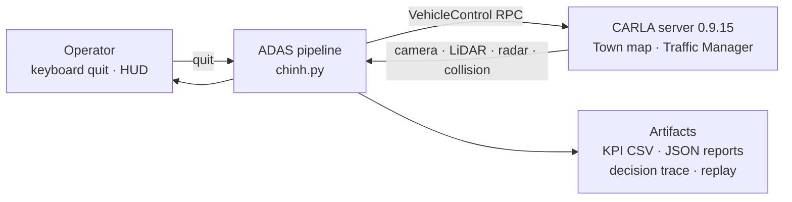
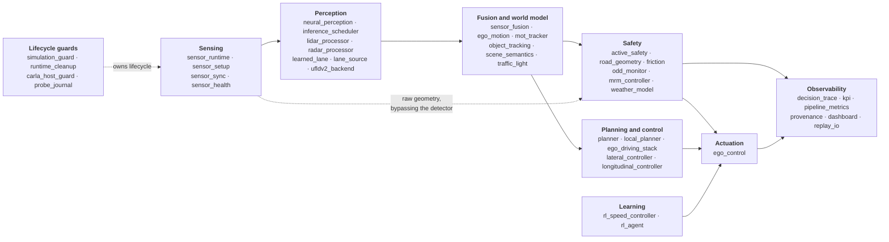
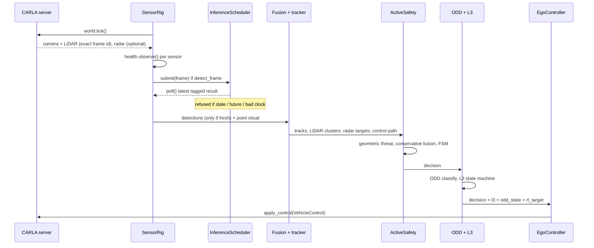
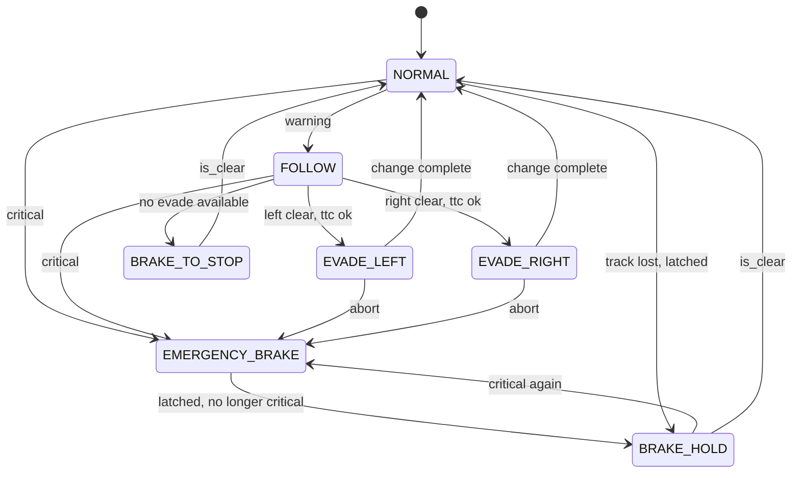
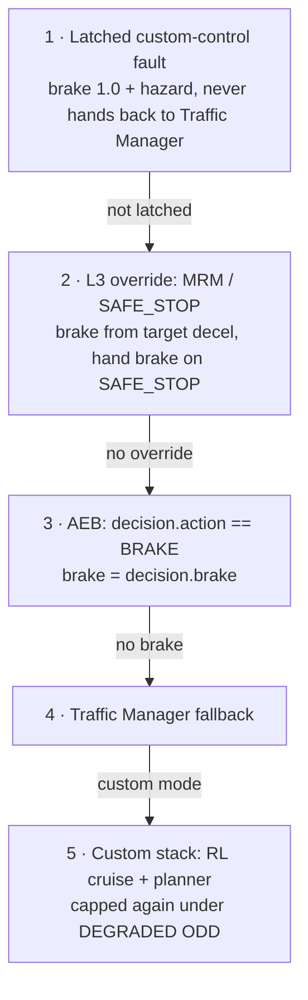
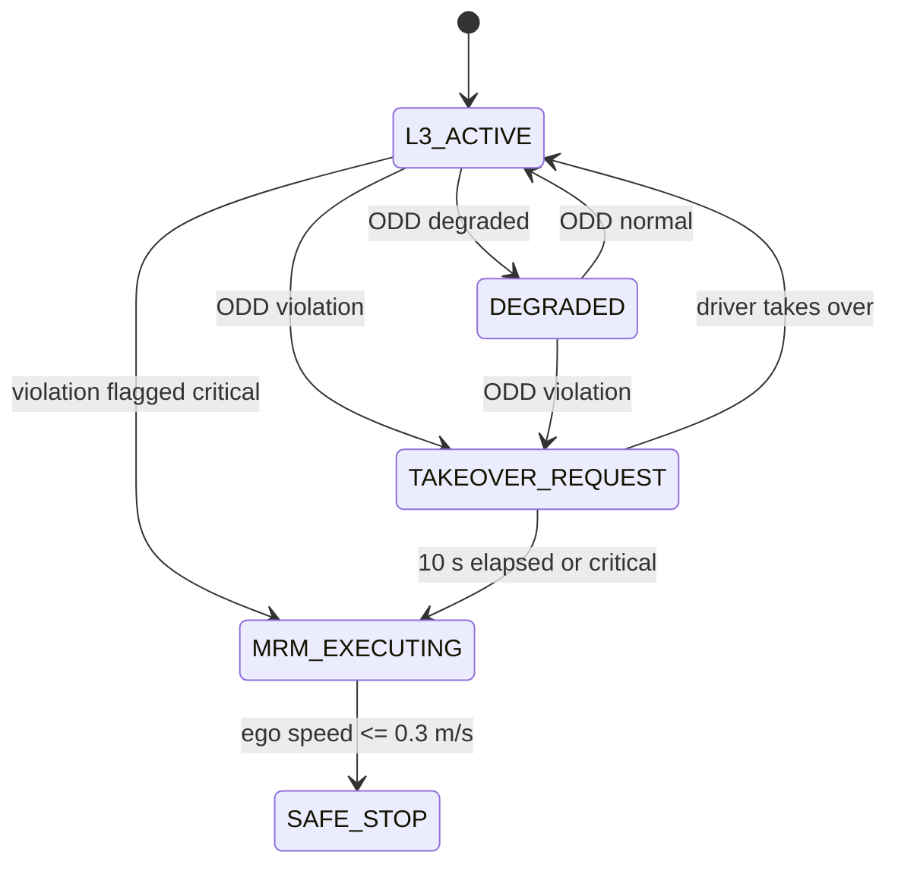
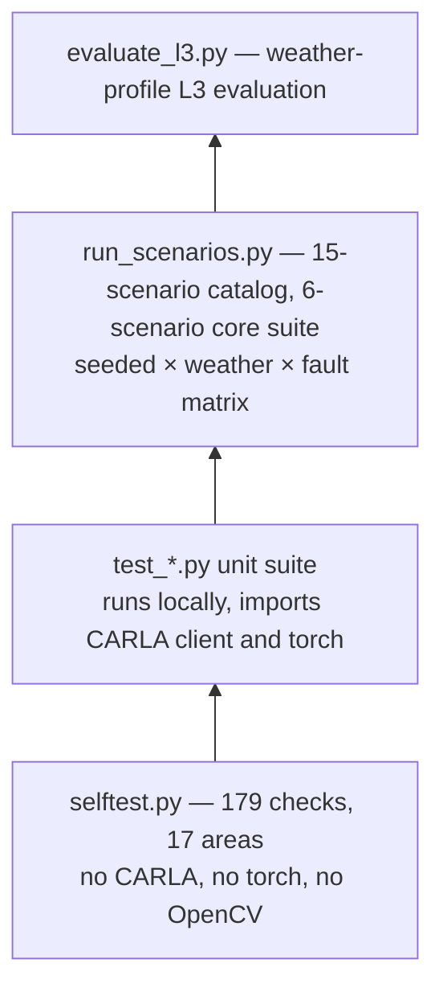
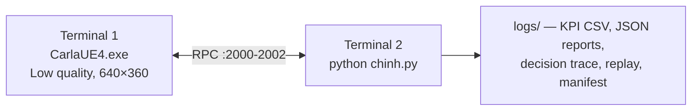

# System Architecture

**CARLA ADAS — Perception → Fusion → Committed Active Safety → Control**

This document describes how the system is put together and, more importantly, *why*
it is put together that way. The [README](../README.md) carries the one-screen
summary; this is the version for someone who intends to read the code.

Every constant, state name and ordering below was read out of the source, not
recalled. File and symbol references are given so each claim can be checked. Where
the implementation diverges from the intent, that is recorded in
[§12 Known architectural gaps](#12-known-architectural-gaps) rather than smoothed over.

**Status.** This is a portfolio demonstrator, not a certified product. It runs in
simulation, detection uses pretrained COCO weights, and the scope boundaries are
stated in the README. The architecture is nonetheless written to production
conventions, because those conventions are the point of the exercise.

---

## Table of contents

1. [Architectural drivers](#1-architectural-drivers)
2. [Context view](#2-context-view)
3. [Execution model](#3-execution-model)
4. [Component view](#4-component-view)
5. [One tick, in order](#5-one-tick-in-order)
6. [Concurrency and freshness](#6-concurrency-and-freshness)
7. [Safety architecture](#7-safety-architecture)
8. [Command arbitration](#8-command-arbitration)
9. [L3: ODD, takeover and minimal risk](#9-l3-odd-takeover-and-minimal-risk)
10. [Interfaces and contracts](#10-interfaces-and-contracts)
11. [Failure handling and teardown](#11-failure-handling-and-teardown)
12. [Known architectural gaps](#12-known-architectural-gaps)
13. [Verification architecture](#13-verification-architecture)
14. [Deployment view](#14-deployment-view)

---

## 1. Architectural drivers

Five constraints shaped nearly every structural decision. They are listed first
because the rest of the document is downstream of them.

**D1 — The brake must not depend on a neural network being right.**
A detector that misses a pedestrian, mislabels a truck, or returns nothing at all
must not be able to suppress an emergency stop. This is the strongest driver in the
system and it is why the safety path is *geometric*: the emergency-brake decision
is computed by sweeping the ego vehicle's own planned corridor through metric LiDAR
and radar returns, not by reading a classifier's confidence. Camera detections
inform behaviour and supply labels; they never hold sole authority over braking.
See [§7](#7-safety-architecture).

**D2 — Determinism, so that a result can be reproduced.**
CARLA runs in synchronous mode at a fixed timestep. Every scenario run is seeded.
A number that cannot be reproduced is not evidence, and the scenario harness exists
to produce evidence. See [§3](#3-execution-model) and [§13](#13-verification-architecture).

**D3 — Bounded latency with an explicit freshness contract.**
Neural inference is slower than the control loop, so it runs off the tick. That
creates the real hazard: a *stale* perception product silently driving a *current*
control decision. The system therefore attaches a frame id and timestamp to every
asynchronous product and refuses to admit one that is too old, from the future, or
carrying an unusable clock. See [§6](#6-concurrency-and-freshness).

**D4 — Safety overrides comfort, and overrides learning.**
There is exactly one place where competing commands are resolved, and its order is
fixed. A reinforcement-learning policy may choose a cruise speed only from inside an
envelope that has already been validated. See [§8](#8-command-arbitration).

**D5 — Fail closed, and prove the exit.**
Any exception in the control path latches a safe stop before it is diagnosed. Any
run whose teardown cannot be *verified* is reported as a failed run, even if the
driving itself went well. See [§11](#11-failure-handling-and-teardown).

---

## 2. Context view



The pipeline is a client. It owns no simulation state of its own: the world, the
ego vehicle, the traffic and the sensors all live in the server, and the pipeline
holds references it is responsible for destroying. That ownership boundary is what
[§11](#11-failure-handling-and-teardown) is about.

---

## 3. Execution model

| Property | Value | Source |
|---|---|---|
| Tick rate | `FPS = 40` | `config.py:16` |
| Fixed timestep | `FIXED_DELTA = 1/40 = 0.025 s` | `config.py:17` |
| Safety deadline | `SAFETY_DEADLINE_MS = 25.0` | `config.py:204` |
| Perception deadline | `PERCEPTION_DEADLINE_MS = 50.0` | `config.py:206` |
| Max async result age | `MAX_ASYNC_RESULT_AGE_MS = 150.0` | `config.py:207` |

The loop is single-threaded and synchronous by default. `SensorRig.read()` issues
`world.tick()` and then retrieves the camera and LiDAR frames **for that exact
frame id**, raising rather than substituting a neighbour
(`modules/sensor_sync.py:59-92`). The simulation does not advance again until the
pipeline has applied a control command, so there is no wall-clock race between
perception and actuation: one tick in, one command out.

There is a second mode. `stable_async` releases synchronous mode before any GPU
sensor exists (`chinh.py:237-240`) and uses the LiDAR stream as the reference clock
(`sensor_runtime.py:176-179`); the camera is then matched *at or before* the LiDAR
frame, with the skew recorded every read (`sensor_runtime.py:203-204`). This mode
exists because of a native engine crash on this build — see
[`docs/B01_FAILURE_ANALYSIS.md`](B01_FAILURE_ANALYSIS.md). It trades exact frame
pairing for stability, and it makes the trade *visible* through the skew statistic
rather than hiding it.

**Why synchronous is the default.** Under asynchronous simulation the server keeps
advancing while the pipeline thinks. The safety margin computed from a 40 ms-old
distance is not the margin the vehicle actually has, and the error grows with load —
precisely when braking matters. Fixing the timestep converts a timing bug into an
arithmetic one.

---

## 4. Component view

Seventy-two modules group into nine subsystems. Only `chinh.py` knows about more
than one of them; it contains no perception or control algorithm of its own.



The dotted edge from Sensing straight into Safety is driver **D1** drawn as a line.
LiDAR clusters and radar returns reach the emergency-brake decision without passing
through the detector, so the safety path stays live when perception is degraded or
absent.

| Subsystem | Responsibility | Key modules |
|---|---|---|
| Sensing | Spawn and own sensors, pair frames to ticks, detect sensor loss | `sensor_runtime.py`, `sensor_sync.py`, `sensor_health.py` |
| Perception | Detection, lane estimation, LiDAR clustering, radar filtering | `neural_perception.py`, `inference_scheduler.py`, `lidar_processor.py`, `radar_processor.py`, `learned_lane.py` |
| Fusion | Extrinsic projection, association, Kalman tracking with ego-motion compensation | `sensor_fusion.py`, `mot_tracker.py`, `ego_motion.py` |
| Safety | Geometric threat assessment, committed AEB/evade arbiter | `active_safety.py`, `road_geometry.py`, `friction.py` |
| L3 | ODD classification, takeover request, minimal-risk manoeuvre | `odd_monitor.py`, `mrm_controller.py`, `weather_model.py` |
| Planning/control | Route intent, lane change, pure pursuit, longitudinal PID | `planner.py`, `local_planner.py`, `ego_driving_stack.py`, `lateral_controller.py`, `longitudinal_controller.py` |
| Learning | DQN cruise-speed policy inside a kinematic envelope | `rl_speed_controller.py`, `rl_agent.py`, `rl_experiment.py` |
| Actuation | The single point where competing commands are resolved | `ego_control.py` |
| Observability | Decision trace, KPI, stage metrics, provenance manifest | `decision_trace.py`, `kpi.py`, `pipeline_metrics.py`, `provenance.py` |
| Guards | World lifecycle, verified teardown, host identity | `simulation_guard.py`, `runtime_cleanup.py`, `carla_host_guard.py` |

---

## 5. One tick, in order



The numbered sequence in `chinh.py:356-638` is, condensed: duration check → timers →
crash-journal mark → `sensor_rig.read()` (this is where the tick happens) → LiDAR
safety obstacles and radar processing → sensor health → frame bundle → inference
submit and poll → lane poll → **age gate on cached detections** → traffic semantics →
ego kinematics → lane arbitration producing `control_path` → ego-motion and tracker
update → `active_safety.update()` → decision trace → ODD and L3 → RL target every
`RL_SPEED_EVERY_N = 5` frames → target clamp → crash-journal mark →
`ego_controller.apply()` → crash-journal mark → metrics → HUD.

Two orderings in that list are load-bearing rather than incidental. The age gate
runs **before** fusion and traffic control, so expired camera semantics are cleared
to empty rather than quietly reused (`chinh.py:462-477`). And the tracker is updated
with detections **only if the inference was fresh** (`chinh.py:505-511`); otherwise
it is stepped with an empty observation set, so tracks coast on their own motion
model instead of being re-confirmed by evidence that has aged out.

---

## 6. Concurrency and freshness

Neural inference runs on a daemon worker thread, one per scheduler
(`inference_scheduler.py:63-64`). There are two schedulers — objects and learned
lane — and no thread pool.

**There is no queue. There is one replaceable slot.**
`_pending: Optional[InferenceRequest]` (`inference_scheduler.py:43`). If a new frame
arrives while an older one is still waiting, the older one is *overwritten* and a
`replaced` counter increments (`inference_scheduler.py:81-84`).

This is the deliberate choice. A queue under sustained overload grows, and every
result it eventually emits describes a world that has moved on; latency degrades
without any single component reporting a fault. A single replaceable slot fails the
other way: it drops work it cannot keep up with, keeps the freshest frame, and
records exactly how often it had to. Lane inference is submitted from inside the
object worker with `only_if_idle=True` (`neural_perception.py:116-118`), so the
optional product can never delay the required one.

**Freshness is a contract, not a convention.** Every asynchronous product carries a
frame id and timestamp (`modules/perception_contracts.py`). `validate_frame_age()`
(`perception_contracts.py:121-138`) raises `FrameAgeError` with a stable telemetry
reason in four cases:

| Reason | Condition |
|---|---|
| `invalid_limit` | the age limit itself is non-numeric, non-finite or negative |
| `future_frame` | the product's frame id is ahead of the current frame |
| `invalid_clock` | the computed age is not finite |
| `stale` | age exceeds `max_age_ms` (default 150 ms) |

`InferenceScheduler.latest()` enforces it at the read boundary and, on failure,
withholds the payload entirely rather than passing it on with a warning
(`inference_scheduler.py:143-163`). A future timestamp is treated as *unusable*, not
as *very fresh* — the sign error that would otherwise make a broken clock look like
the best possible input.

---

## 7. Safety architecture

### 7.1 Geometry first

`ActiveSafety` computes three independent threat estimates, each by projecting a
measurement onto the ego vehicle's own planned path
(`project_to_safety_path`, `modules/road_geometry.py:19`):

| Source | Function | Admission test |
|---|---|---|
| LiDAR clusters | `_scan_corridors()` (`active_safety.py:119`) | `x > 0` and `\|lateral\| < lane_half`; cluster must hold `MIN_CLUSTER_POINTS = 5` points, relaxed to 2 if flagged safety-critical |
| Tracked objects | `_predictive()` (`active_safety.py:165`) | corridor widened by a VRU margin for person / bicycle / motorcycle; tracks are stepped forward 0.25 s at a time to catch cut-ins |
| Radar targets | `_radar_threat()` (`active_safety.py:203`) | `along > 0` and `\|lateral\| < lane_half` |

Note what gates the LiDAR source: **point count**, not classifier score. That is
driver D1 in one line of code. The camera contributes a *label for display only*
(`_label_for()`, `active_safety.py:250`); it cannot create or suppress a brake.

The three estimates are combined by taking the most conservative of each quantity —
`nearest = min(...)`, `ttc = min(...)`, `closing = max(...)`
(`active_safety.py:300-316`). They are never averaged. Averaging a true 8 m reading
with a spurious 40 m reading yields 24 m, which is neither sensor's opinion and is
wrong in the dangerous direction.

### 7.2 Thresholds

```
brake_dist = v·t_reaction + v² / (2·μ·g)          friction.py:15-19, g = 9.81
dyn_safe   = gap_multiplier · brake_dist + MIN_SAFE_DIST_M
critical   = nearest < MIN_SAFE_DIST_M  or  ttc < CRITICAL_TTC_S
warning    = nearest < dyn_safe         or  ttc < WARNING_TTC_S
```

| Constant | Value | Source |
|---|---|---|
| `CRITICAL_TTC_S` | 1.6 s | `config.py:134` |
| `WARNING_TTC_S` | 3.0 s | `config.py:135` |
| `MIN_SAFE_DIST_M` | 6.0 m | `config.py:131` |
| `REACTION_TIME_S` | 1.0 s | `config.py:130` |
| `LANE_HALF_WIDTH_M` | 1.75 m | `config.py:124` |
| `MIN_CLOSING_SPEED` | 0.3 m/s | `config.py:136` |
| `DRY_FRICTION_MU` | 0.85 | `config.py:261` |

`gap_multiplier` is supplied by the ODD monitor: 1.0 normal, 1.5 degraded, 2.0 on
violation (`odd_monitor.py:37-49`). Degrading the environment therefore widens the
safety envelope automatically, without a separate rule.

### 7.3 The committed state machine



An evade aborts into a latched `EMERGENCY_BRAKE` when `getting_dangerous`
(`ttc < critical_ttc × 1.3` or `nearest < min_safe_dist × 1.3`) or when the target
side stops being clear (`active_safety.py:408-421`). "ttc ok" on the diagram is
`ttc >= evade_min_ttc = 2.0` (`:91`) — below that there is no longer time to
change lanes, so the system brakes instead.

Three mechanisms keep this from oscillating, all in `active_safety.py`:

- **Commitment.** An evade, once begun, runs for `evade_commit_s = 1.5 s`
  (`:89`) — 60 frames at `dt = 0.025` (`:436`). A threshold-only arbiter re-decides
  every 25 ms and can abandon a half-completed lane change in the middle of the
  adjacent lane, which is worse than either committing or braking.
- **Hysteresis.** The brake releases only when
  `nearest > dyn_safe × 1.4` **and** `ttc > warning_ttc × 1.4`
  (`brake_exit_factor = 1.4`, `:90`, test at `:377-378`). Release and engage use
  different thresholds, so a measurement sitting on the line cannot chatter.
- **Latch tolerance.** If tracking is lost entirely while the brake is latched, the
  brake is *held* for `lost_frames_tol = 4` frames (`:108`, `:326-332`) before the
  state is cleared. Losing sight of an obstacle is not evidence that it is gone.

Decision order inside `update()` is fixed and first-match-wins: latched brake →
critical → committed evade phase → must-act → warning → normal
(`active_safety.py:264-456`). Emergency braking is evaluated before evasion, and an
in-progress evade is aborted into a latched brake if conditions deteriorate
(`:408-421`).

---

## 8. Command arbitration

Everything above produces *proposals*. Exactly one function turns proposals into a
`VehicleControl`, and its order is fixed
(`modules/ego_control.py:4`, implemented at `:170-237`):



The first matching branch wins and returns. Two details are worth naming:

**Exceptions latch before they are explained.** Any exception raised inside the
custom stack sets `mode = "custom_fault_safe_stop"` *first*, then formats the error
(`ego_control.py:222-237`). The in-code comment is the design rule: latch first,
brake second, diagnose last. Once latched, the vehicle is never handed back to the
Traffic Manager, because a failure in the custom stack is not evidence that autopilot
is a safe destination.

**The learned policy is contained three times over.** A DQN
(`5 → 64 → 64 → 6`, `rl_agent.py:14-21`) proposes a cruise speed, and:

1. It can only choose from the discrete set `ACTIONS_KMH = [0, 15, 25, 35, 45, 55]`
   (`rl_experiment.py:69`) — it cannot request an arbitrary speed.
2. Its output is clamped by a kinematic envelope computed independently of the
   network: `min(√(2·a_comfort·usable), nearest / time_gap)`, squeezed further when
   TTC < 6 s (`rl_speed_controller.py:49-67`, applied at `:81`).
3. It is capped again to 40 km/h when the ODD is DEGRADED
   (`ego_control.py:202-203`), and it sits at rank 5 in the arbitration above, so
   AEB and MRM overwrite it outright.

If the policy checkpoint fails to load for any reason, the controller falls back to
a three-branch density heuristic (`rl_speed_controller.py:26-47`). The learned
component is a *comfort optimiser inside a validated envelope*, never a safety
authority.

---

## 9. L3: ODD, takeover and minimal risk

`odd_monitor.py` classifies the operating envelope each frame from visibility,
friction, signal-to-noise and sensor redundancy:

| State | Condition | Speed cap | Gap multiplier |
|---|---|---|---|
| `NORMAL` | otherwise | none | 1.0 |
| `DEGRADED` | visibility ≤ 50 m or μ < 0.6 | 40 km/h | 1.5 |
| `VIOLATION` | redundancy lost, or visibility < 20 m, or μ < 0.3, or SNR < 0.25 | 0 km/h | 2.0 |

`range_redundancy_lost` requires **both** LiDAR and radar to exceed their miss
threshold (`sensor_health.py:59-65`) — losing one range sensor is a degradation,
losing both is a violation, and the distinction is what keeps the system from
declaring an emergency over a single dropped frame.



`TOR_WINDOW_S = 10.0` and `MRM_DECEL_FRAC = 0.35` (`config.py:262-263`). The MRM
deceleration target is `0.35 · μ · g` (`mrm_controller.py:76-87`) — a fraction of
available grip rather than a fixed number, so the manoeuvre is gentler on ice than
on dry tarmac. A violation marked `critical` (redundancy lost, visibility < 10 m, or
μ < 0.2) skips the takeover window entirely (`odd_monitor.py:56`,
`mrm_controller.py:40-44`). `SAFE_STOP` has no exit transition inside the state
machine; resuming is the orchestrator's decision, not the state machine's
(`mrm_controller.py:73`).

`mrm_controller.py` imports nothing from CARLA (`:13-14`), which is why the whole L3
chain is exercised by the simulator-free self-test.

---

## 10. Interfaces and contracts

**`config.py` is the single source of truth** for sensor geometry and safety
thresholds. Modules receive values; they do not define their own. The exception is
documented in [§12](#12-known-architectural-gaps).

**`modules/perception_contracts.py`** defines the typed products crossing the async
boundary — `SensorState`, `SensorFrameBundle`, `LaneEstimate`, `FusedTrack`,
`SceneEstimate`, `TaggedInferenceResult` — each carrying `frame_id` and `timestamp`.
It imports neither CARLA nor a deep-learning framework, so contracts are
serialisable for replay and testable offline. `LaneEstimate` carries an explicit
`valid: bool` and a `reason` string: a lane product must *declare* its validity
rather than have validity inferred from whether it looks plausible.

**`modules/decision_trace.py`** is observability and is fenced off from control by
its own docstring and by construction: it does not own thresholds, alter decisions
or issue controls. It records only intervention frames — `DRIVE` frames are counted,
not stored (`:140-144`) — into a 512-entry ring buffer, and every context build is
wrapped so that "new diagnostics must not interrupt delivery of an existing brake"
(`:182-186`).

**`modules/provenance.py`** writes a run manifest: SHA-256 of every model file,
platform, Python, CARLA, torch and CUDA versions, and the config in force, written
atomically via `.tmp` + `os.replace`. A KPI number without a manifest cannot be tied
to the weights that produced it.

---

## 11. Failure handling and teardown

The pipeline holds server-side resources. If it exits without releasing them, the
CARLA world is left synchronous and littered with orphaned actors, and the next run
starts from a corrupted state. Teardown is therefore treated as a verified
operation, not a best effort.

`cleanup_runtime()` (`modules/runtime_cleanup.py:10-128`) runs under a cooperative
budget (`budget_s = 20.0`, `rpc_timeout_s = 2.0`) and records `PASS` / `FAIL` /
`UNKNOWN` per step. When an RPC step fails it performs one bounded liveness probe
and then stops issuing calls to a server that is not answering, rather than
compounding a hang.

`verify_world()` (`:94-112`) is the actual guarantee. It compares six world-settings
fields against the originals, asserts that no owned actor ID remains, refuses to
certify from a still-synchronous world, and requires a real post-cleanup frame
advance via `world.wait_for_tick`. If verification does not pass, `chinh.py:658-663`
fails the run and the process exits non-zero — **a clean drive with an unverified
exit is a failed run.**

Layered under that: `SynchronousWorldSession` registers an `atexit` close
(`simulation_guard.py:120-122`) and handles the awkward CARLA state where settings
applied server-side but the RPC timed out, by sending one bounded recovery tick and
restoring the originals if it cannot confirm (`:16-63`). The probe journal marks
`sensor.before` / `sensor.after` / `control.before` / `control.after` each tick, so a
native crash can be localised to the phase that was running.

---

## 12. Known architectural gaps

Recorded because an architecture document that only describes the intent is a
brochure.

**G1 — `planner.py`'s emergency branch is unreachable.** `DrivingState.EMERGENCY_STOP`
is selected from `collision_risk` (`planner.py:34-37`), but `ego_driving_stack.py:106`
hardcodes `"collision_risk": False` in the metrics dict it passes. AEB is handled one
layer above, in `ego_control.py`, so behaviour is correct — but the planner carries a
safety branch that never executes, and `OBSTACLE_AVOIDANCE` is declared and never
assigned. Both should be deleted or wired.

**G2 — The cruise floor is applied after the safety cap.**
`RL_MIN_CRUISE_KMH = 18.0` is applied at `chinh.py:556`, *after*
`rl_speed_controller` has already clamped the target to its kinematic envelope. A
floor applied after a cap can raise a deliberately-lowered target. In practice AEB
and L3 sit above this in arbitration and overwrite it, so no unsafe command has been
observed — but the ordering is wrong and the floor should move above the cap.

**G3 — ODD inputs are static within a run.** `estimate_conditions()` and
`set_conditions()` are called once before the loop (`chinh.py:300-306`); only
`odd_monitor.classify()` re-runs per frame (`:532`). Friction, visibility and SNR are
therefore derived from the weather profile and fixed for the run; the only ODD input
that genuinely varies is sensor redundancy loss. Dynamic weather would require
moving the estimate inside the loop.

**G4 — Two safety constants live outside `config.py`.** `evade_commit_s = 1.5` and
`brake_exit_factor = 1.4` are hardcoded in `ActiveSafety.__init__`
(`active_safety.py:89-90`) rather than in the single source of truth, so they cannot
be swept by the scenario harness without editing code.

**G5 — The README state diagram is incomplete.** It shows four states; the
implementation also emits `BRAKE_HOLD` and `BRAKE_TO_STOP`
(`active_safety.py:332, 385, 444`). The diagram in [§7.3](#73-the-committed-state-machine)
is the complete one.

**G6 — `carla_host_guard.py` is not wired into the main pipeline.** It is used only
by `smoke_carla_stack.py` and `test_carla_probe.py`. The identity checks it performs —
executable hash, PID creation time to defeat PID reuse, foreign connections on the
CARLA ports — would be worth running before a scored scenario batch too.

**G7 — B01, the native render-thread crash**, is root-caused and documented in
[`docs/B01_FAILURE_ANALYSIS.md`](B01_FAILURE_ANALYSIS.md) but not fixed; it lives in
the engine build, not in this code. `stable_async` is the mitigation, and its cost is
the frame-pairing skew described in [§3](#3-execution-model).

---

## 13. Verification architecture



**Tier 1 — simulator-free self-test.** `selftest.py` runs **179 checks across 17
areas** and imports neither CARLA nor torch nor OpenCV (`selftest.py:1-13`). It
covers fusion projection, the AEB state machine, the low-speed stationary
regression, tracking, predictive AEB, the commitment/hysteresis arbiter, stopping
distance, the weather/ODD model, the L3 state machine, the scenario catalog, the RL
experiment and controller, sensor frame integrity, planning and control, traffic
semantics, and the radar/health/async/lane contracts. This tier exists so that the
safety logic is verifiable in CI, where no simulator can run.

**Tier 2 — unit suite.** The `test_*.py` files at repository root exercise the parts
that need the CARLA client or a GPU. They run locally and deliberately not in CI
(`.github/workflows/selftest.yml:3-7`).

**Tier 3 — scenario harness.** `run_scenarios.py` runs a catalog of 15 scenarios
across lead / crossing / cut-in / junction / oncoming categories, nested
seeds × weathers × scenarios, with `np.random.seed()` and
`tm.set_random_device_seed()` both pinned per run. Verdicts come from three
orthogonal assessors ANDed together — scenario, fault behaviour, weather behaviour —
against explicit acceptance criteria embedded in the report: zero collisions,
reaction delay ≤ 1.0 s, minimum clearance ≥ 0.25 m, zero sensor frame errors, and
cut-ins must produce a brake or an evade. Reaction latency is measured from
`hazard_frame`, not `trigger_frame`, because a cut-in actor is still in the adjacent
lane when the trigger fires (`scenario_library.py:32-38`) — measuring from the wrong
origin would flatter the result.

**CI** (`.github/workflows/selftest.yml`) runs three jobs on every push and pull
request to `main`: Ruff correctness lint, Mypy over the safety-evidence core, and
the 179-check self-test.

---

## 14. Deployment view



Both processes run on one workstation. The pipeline connects to `127.0.0.1:2000`
with a 30 s timeout and reloads the map only on a genuine map change
(`chinh.py:104-111`). Ports 2000–2002 are what `carla_host_guard.py` inspects when
it is used. Exact versions, install steps and the stable demo envelope are in the
[README](../README.md#getting-started); the recorded runbook is in
[`docs/DEMO_RUNBOOK.md`](DEMO_RUNBOOK.md).

---

## Where to look next

| Question | Document |
|---|---|
| What is in scope and what is deliberately not | [README § Scope & status](../README.md#scope--status) |
| How requirements map to modules and tests | [`docs/REQUIREMENT_MAP.md`](REQUIREMENT_MAP.md) |
| The native crash, root-caused | [`docs/B01_FAILURE_ANALYSIS.md`](B01_FAILURE_ANALYSIS.md) |
| Reproducing the demo run | [`docs/DEMO_RUNBOOK.md`](DEMO_RUNBOOK.md) |
| Dataset acceptance gates | [`docs/DATASET_V2_ACCEPTANCE.md`](DATASET_V2_ACCEPTANCE.md) |
| Pre-deployment audit | [`docs/DEPLOYMENT_READINESS_AUDIT_20260905.md`](DEPLOYMENT_READINESS_AUDIT_20260905.md) |
