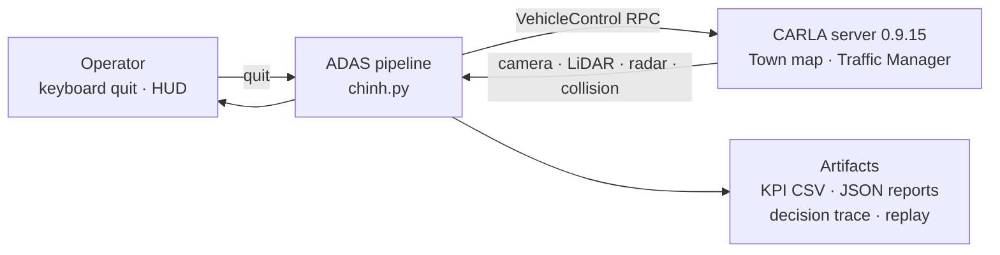
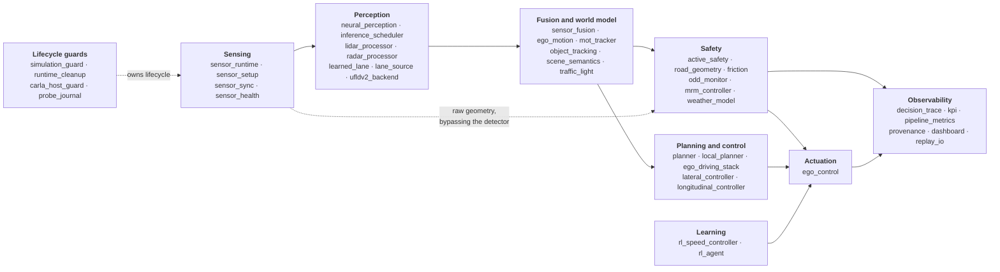
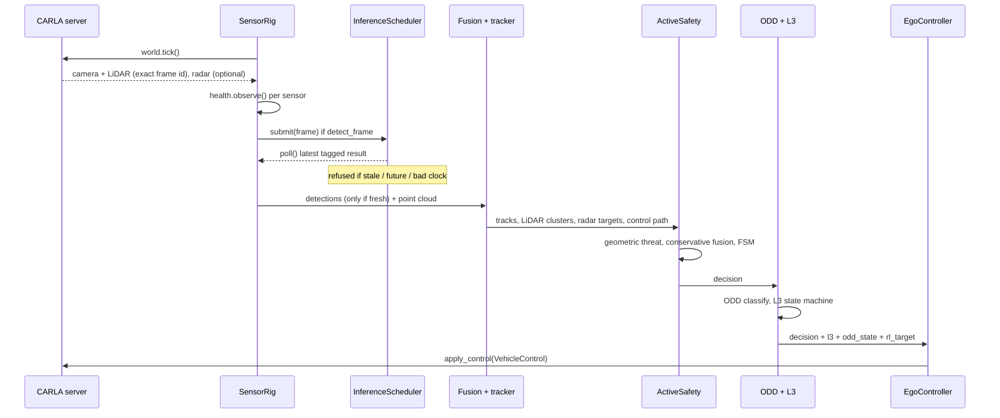
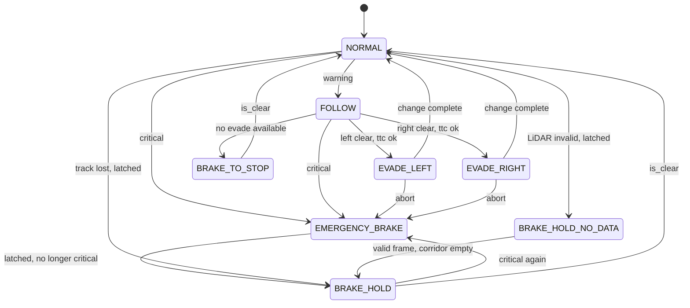
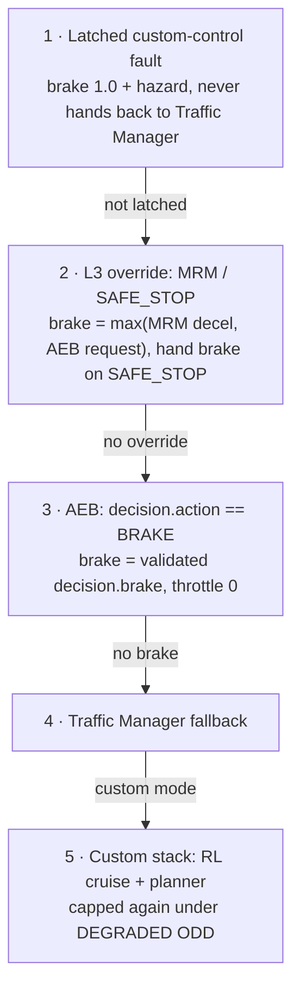
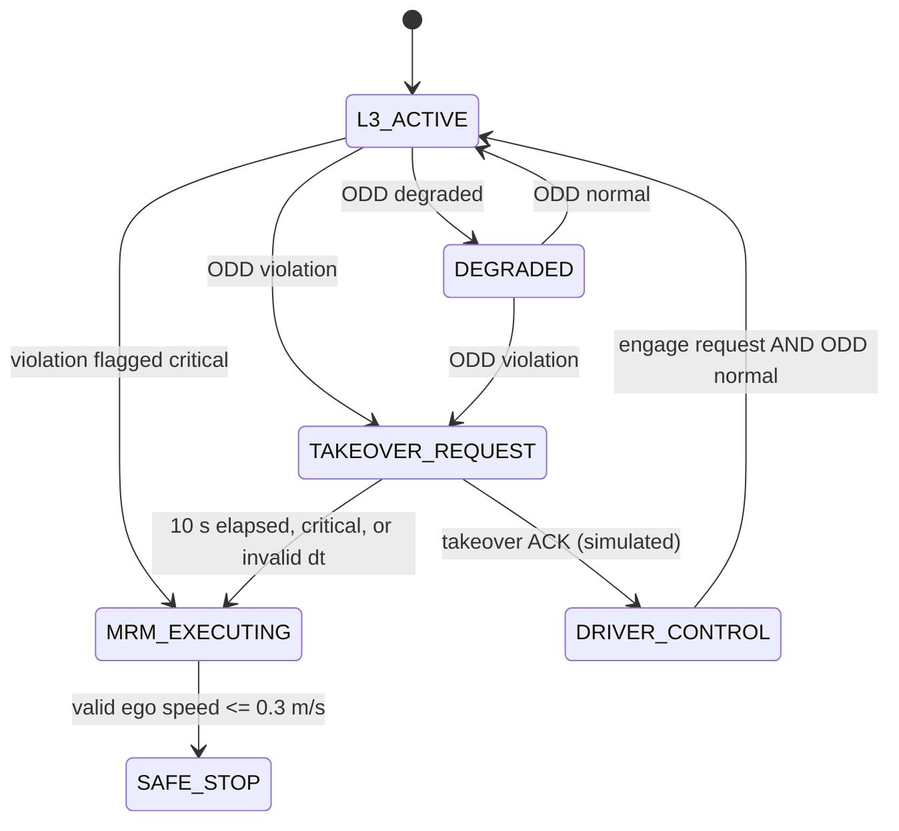
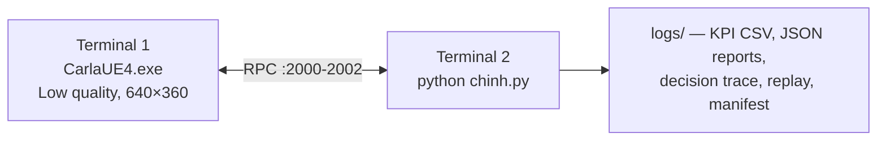

# System Architecture

**CARLA ADAS — Perception → Fusion → Committed Active Safety → Control**

This document describes how the system is put together and, more importantly, *why*
it is put together that way. The [README](../README.md) carries the one-screen
summary; this is the version for someone who intends to read the code.

Every constant, state name and ordering below was read out of the source, not
recalled. File and symbol references are given so each claim can be checked. Where
the implementation diverges from the intent, that is recorded in
[§12 Known architectural gaps](#12-known-architectural-gaps) rather than smoothed over.

**Status.** This is a portfolio demonstrator, not a certified product. It runs in
simulation, detection uses pretrained COCO weights, and the scope boundaries are
stated in the README. The architecture is nonetheless written to production
conventions, because those conventions are the point of the exercise.

---

## Table of contents

1. [Architectural drivers](#1-architectural-drivers)
2. [Context view](#2-context-view)
3. [Execution model](#3-execution-model)
4. [Component view](#4-component-view)
5. [One tick, in order](#5-one-tick-in-order)
6. [Concurrency and freshness](#6-concurrency-and-freshness)
7. [Safety architecture](#7-safety-architecture)
8. [Command arbitration](#8-command-arbitration)
9. [L3: ODD, takeover and minimal risk](#9-l3-odd-takeover-and-minimal-risk)
10. [Interfaces and contracts](#10-interfaces-and-contracts)
11. [Failure handling and teardown](#11-failure-handling-and-teardown)
12. [Known architectural gaps](#12-known-architectural-gaps)
13. [Verification architecture](#13-verification-architecture)
14. [Deployment view](#14-deployment-view)

---

## 1. Architectural drivers

Five constraints shaped nearly every structural decision. They are listed first
because the rest of the document is downstream of them.

**D1 — The brake must not depend on a neural network being right.**
A detector that misses a pedestrian, mislabels a truck, or returns nothing at all
must not be able to suppress an emergency stop. This is the strongest driver in the
system and it is why the safety path is *geometric*: the emergency-brake decision
is computed by sweeping the ego vehicle's own planned corridor through metric LiDAR
and radar returns, not by reading a classifier's confidence. Camera detections
inform behaviour and supply labels; they never hold sole authority over braking.
See [§7](#7-safety-architecture).

**D2 — Determinism, so that a result can be reproduced.**
CARLA runs in synchronous mode at a fixed timestep. Every scenario run is seeded.
A number that cannot be reproduced is not evidence, and the scenario harness exists
to produce evidence. See [§3](#3-execution-model) and [§13](#13-verification-architecture).

**D3 — Bounded latency with an explicit freshness contract.**
Neural inference is slower than the control loop, so it runs off the tick. That
creates the real hazard: a *stale* perception product silently driving a *current*
control decision. The system therefore attaches a frame id and timestamp to every
asynchronous product and refuses to admit one that is too old, from the future, or
carrying an unusable clock. See [§6](#6-concurrency-and-freshness).

**D4 — Safety overrides comfort, and overrides learning.**
There is exactly one place where competing commands are resolved, and its order is
fixed. A reinforcement-learning policy may choose a cruise speed only from inside an
envelope that has already been validated. See [§8](#8-command-arbitration).

**D5 — Fail closed, and prove the exit.**
Any exception in the control path latches a safe stop before it is diagnosed. Any
run whose teardown cannot be *verified* is reported as a failed run, even if the
driving itself went well. See [§11](#11-failure-handling-and-teardown).

---

## 2. Context view



The pipeline is a client. It owns no simulation state of its own: the world, the
ego vehicle, the traffic and the sensors all live in the server, and the pipeline
holds references it is responsible for destroying. That ownership boundary is what
[§11](#11-failure-handling-and-teardown) is about.

---

## 3. Execution model

| Property | Value | Source |
|---|---|---|
| Tick rate | `FPS = 40` | `config.py:16` |
| Fixed timestep | `FIXED_DELTA = 1/40 = 0.025 s` | `config.py:17` |
| Safety deadline | `SAFETY_DEADLINE_MS = 25.0` | `config.py:213` |
| Perception deadline | `PERCEPTION_DEADLINE_MS = 50.0` | `config.py:214` |
| Max async result age | `MAX_ASYNC_RESULT_AGE_MS = 150.0` | `config.py:211` |

The loop is single-threaded and synchronous by default. `SensorRig.read()` issues
`world.tick()` and then retrieves the camera and LiDAR frames **for that exact
frame id**, raising rather than substituting a neighbour
(`modules/sensor_sync.py:59-92`). The simulation does not advance again until the
pipeline has applied a control command, so there is no wall-clock race between
perception and actuation: one tick in, one command out.

There is a second mode. `stable_async` releases synchronous mode before any GPU
sensor exists (`chinh.py:237-240`) and uses the LiDAR stream as the reference clock
(`sensor_runtime.py:176-179`); the camera is then matched *at or before* the LiDAR
frame, with the skew recorded every read (`sensor_runtime.py:203-204`). This mode
exists because of a native engine crash on this build — see
[`docs/B01_FAILURE_ANALYSIS.md`](B01_FAILURE_ANALYSIS.md). It trades exact frame
pairing for stability, and it makes the trade *visible* through the skew statistic
rather than hiding it.

**Why synchronous is the default.** Under asynchronous simulation the server keeps
advancing while the pipeline thinks. The safety margin computed from a 40 ms-old
distance is not the margin the vehicle actually has, and the error grows with load —
precisely when braking matters. Fixing the timestep converts a timing bug into an
arithmetic one.

---

## 4. Component view

Seventy-two modules group into nine subsystems. Only `chinh.py` knows about more
than one of them; it contains no perception or control algorithm of its own.



The dotted edge from Sensing straight into Safety is driver **D1** drawn as a line.
LiDAR clusters and radar returns reach the emergency-brake decision without passing
through the detector, so the safety path stays live when perception is degraded or
absent.

| Subsystem | Responsibility | Key modules |
|---|---|---|
| Sensing | Spawn and own sensors, pair frames to ticks, detect sensor loss | `sensor_runtime.py`, `sensor_sync.py`, `sensor_health.py` |
| Perception | Detection, lane estimation, LiDAR clustering, radar filtering | `neural_perception.py`, `inference_scheduler.py`, `lidar_processor.py`, `radar_processor.py`, `learned_lane.py` |
| Fusion | Extrinsic projection, association, Kalman tracking with ego-motion compensation | `sensor_fusion.py`, `mot_tracker.py`, `ego_motion.py` |
| Safety | Geometric threat assessment, committed AEB/evade arbiter | `active_safety.py`, `road_geometry.py`, `friction.py` |
| L3 | ODD classification, takeover request, minimal-risk manoeuvre | `odd_monitor.py`, `mrm_controller.py`, `weather_model.py` |
| Planning/control | Route intent, lane change, pure pursuit, longitudinal PID | `planner.py`, `local_planner.py`, `ego_driving_stack.py`, `lateral_controller.py`, `longitudinal_controller.py` |
| Learning | DQN cruise-speed policy inside a kinematic envelope | `rl_speed_controller.py`, `rl_agent.py`, `rl_experiment.py` |
| Actuation | The single point where competing commands are resolved | `ego_control.py` |
| Observability | Decision trace, KPI, stage metrics, provenance manifest | `decision_trace.py`, `kpi.py`, `pipeline_metrics.py`, `provenance.py` |
| Guards | World lifecycle, verified teardown, host identity | `simulation_guard.py`, `runtime_cleanup.py`, `carla_host_guard.py` |

---

## 5. One tick, in order



The numbered sequence in `chinh.py:356-638` is, condensed: duration check → timers →
crash-journal mark → `sensor_rig.read()` (this is where the tick happens) → LiDAR
safety obstacles and radar processing → sensor health → frame bundle → inference
submit and poll → lane poll → **age gate on cached detections** → traffic semantics →
ego kinematics → lane arbitration producing `control_path` → ego-motion and tracker
update → `active_safety.update()` → decision trace → ODD and L3 → RL target every
`RL_SPEED_EVERY_N = 5` frames → target clamp → crash-journal mark →
`ego_controller.apply()` → crash-journal mark → metrics → HUD.

Two orderings in that list are load-bearing rather than incidental. The age gate
runs **before** fusion and traffic control, so expired camera semantics are cleared
to empty rather than quietly reused (`chinh.py:462-477`). And the tracker is updated
with detections **only if the inference was fresh** (`chinh.py:505-511`); otherwise
it is stepped with an empty observation set, so tracks coast on their own motion
model instead of being re-confirmed by evidence that has aged out.

---

## 6. Concurrency and freshness

Neural inference runs on a daemon worker thread, one per scheduler
(`inference_scheduler.py:63-64`). There are two schedulers — objects and learned
lane — and no thread pool.

**There is no queue. There is one replaceable slot.**
`_pending: Optional[InferenceRequest]` (`inference_scheduler.py:43`). If a new frame
arrives while an older one is still waiting, the older one is *overwritten* and a
`replaced` counter increments (`inference_scheduler.py:81-84`).

This is the deliberate choice. A queue under sustained overload grows, and every
result it eventually emits describes a world that has moved on; latency degrades
without any single component reporting a fault. A single replaceable slot fails the
other way: it drops work it cannot keep up with, keeps the freshest frame, and
records exactly how often it had to. Lane inference is submitted from inside the
object worker with `only_if_idle=True` (`neural_perception.py:116-118`), so the
optional product can never delay the required one.

**Freshness is a contract, not a convention.** Every asynchronous product carries a
frame id and timestamp (`modules/perception_contracts.py`). `validate_frame_age()`
(`perception_contracts.py:121-138`) raises `FrameAgeError` with a stable telemetry
reason in four cases:

| Reason | Condition |
|---|---|
| `invalid_limit` | the age limit itself is non-numeric, non-finite or negative |
| `future_frame` | the product's frame id is ahead of the current frame |
| `invalid_clock` | the computed age is not finite |
| `stale` | age exceeds `max_age_ms` (default 150 ms) |

`InferenceScheduler.latest()` enforces it at the read boundary and, on failure,
withholds the payload entirely rather than passing it on with a warning
(`inference_scheduler.py:143-163`). A future timestamp is treated as *unusable*, not
as *very fresh* — the sign error that would otherwise make a broken clock look like
the best possible input.

---

## 7. Safety architecture

### 7.1 Geometry first

`ActiveSafety` computes three independent threat estimates, each by projecting a
measurement onto the ego vehicle's own planned path
(`project_to_safety_path`, `modules/road_geometry.py:19`):

| Source | Function | Admission test |
|---|---|---|
| LiDAR clusters | `_scan_corridors()` (`active_safety.py:147`) | `x > 0` and `\|lateral\| < lane_half`; cluster must hold `MIN_CLUSTER_POINTS = 5` points, relaxed to 2 if flagged safety-critical |
| Tracked objects | `_predictive()` (`active_safety.py:193`) | corridor widened by a VRU margin for person / bicycle / motorcycle; tracks are stepped forward 0.25 s at a time to catch cut-ins |
| Radar targets | `_radar_threat()` (`active_safety.py:231`) | `along > 0` and `\|lateral\| < lane_half` |

Note what gates the LiDAR source: **point count**, not classifier score. That is
driver D1 in one line of code. The camera contributes a *label for display only*
(`_label_for()`, `active_safety.py:279`); it cannot create or suppress a brake.

The three estimates are combined by taking the most conservative of each quantity —
`nearest = min(...)`, `ttc = min(...)`, `closing = max(...)`
(`active_safety.py:336-351`). They are never averaged. Averaging a true 8 m reading
with a spurious 40 m reading yields 24 m, which is neither sensor's opinion and is
wrong in the dangerous direction.

### 7.2 Thresholds

```
brake_dist = v·t_reaction + v² / (2·μ·g)          friction.py:15-19, g = 9.81
dyn_safe   = gap_multiplier · brake_dist + MIN_SAFE_DIST_M
critical   = nearest < MIN_SAFE_DIST_M  or  ttc < CRITICAL_TTC_S
warning    = nearest < dyn_safe         or  ttc < WARNING_TTC_S
```

| Constant | Value | Source |
|---|---|---|
| `CRITICAL_TTC_S` | 1.6 s | `config.py:141` |
| `WARNING_TTC_S` | 3.0 s | `config.py:142` |
| `MIN_SAFE_DIST_M` | 6.0 m | `config.py:131` |
| `REACTION_TIME_S` | 1.0 s | `config.py:130` |
| `LANE_HALF_WIDTH_M` | 1.75 m | `config.py:124` |
| `MIN_CLOSING_SPEED` | 0.3 m/s | `config.py:143` |
| `DRY_FRICTION_MU` | 0.85 | `config.py:268` |

`gap_multiplier` is supplied by the ODD monitor: 1.0 normal, 1.5 degraded, 2.0 on
violation (`odd_monitor.py:73-91`), so degrading the environment widens the safety
envelope without needing a separate rule.

That sentence was aspirational when this document was first written, and an external
review was right to test it. `ActiveSafety.set_conditions()` was called once before
the loop; inside the loop the ODD state was re-classified every frame but the
resulting multiplier never reached the safety layer, so a run that degraded to
VIOLATION kept driving on the envelope it had at start-up. It is now pushed down
every frame, in both `chinh.py` and `run_scenarios.py`. The difference is not
cosmetic: at 15 m/s on a wet road `dyn_safe` goes from 46.5 m at ×1.0 to 87.0 m
at ×2.0.

### 7.3 The committed state machine



An evade aborts into a latched `EMERGENCY_BRAKE` when `getting_dangerous`
(`ttc < critical_ttc × 1.3` or `nearest < min_safe_dist × 1.3`) or when the target
side stops being clear (`active_safety.py:467-480`). "ttc ok" on the diagram is
`ttc >= evade_min_ttc = 2.0` (`:110`) — below that there is no longer time to
change lanes, so the system brakes instead.

Three mechanisms keep this from oscillating, all in `active_safety.py`:

- **Commitment.** An evade, once begun, runs for `evade_commit_s = 1.5 s`
  (`:71`) — 60 frames at `dt = 0.025` (`:495`). A threshold-only arbiter re-decides
  every 25 ms and can abandon a half-completed lane change in the middle of the
  adjacent lane, which is worse than either committing or braking.
- **Hysteresis.** The brake releases only when
  `nearest > dyn_safe × 1.4` **and** `ttc > warning_ttc × 1.4`
  (`brake_exit_factor = 1.4`, `:72`, test at `:434-435`). Release and engage use
  different thresholds, so a measurement sitting on the line cannot chatter.
- **Evidence-based release (2026-09-25).** If the corridor is empty while the brake
  is latched, the brake is *held* at its latched level until a clear corridor has
  been observed on **valid** LiDAR frames for `clear_confirm_s = 0.1 s` — the same
  cadence as the old `lost_frames_tol = 4` at 40 Hz, but timed in seconds so it
  means the same thing at any loop rate. A frame without valid LiDAR data
  (`lidar_valid=False`, e.g. an injected LiDAR loss) is not evidence of anything:
  the state is `BRAKE_HOLD_NO_DATA`, the brake is held at its latched level
  indefinitely, and the confirmation restarts. Previously the brake dropped from
  1.0 to 0.7 on the first empty frame and released after five, whether or not the
  data was valid (G9).

Decision order inside `update()` is fixed and first-match-wins: latched brake →
critical → committed evade phase → must-act → warning → normal
(`active_safety.py:292-515`). Emergency braking is evaluated before evasion, and an
in-progress evade is aborted into a latched brake if conditions deteriorate
(`:467-480`).

---

## 8. Command arbitration

Everything above produces *proposals*. Exactly one function turns proposals into a
`VehicleControl`, and its order is fixed
(`modules/ego_control.py:4`, implemented at `:193-287`):



The first matching branch wins and returns — with one exception, which is the
third detail below. Three details are worth naming:

**An MRM does not veto a harder AEB brake.** Until 2026-09-25, branch 2 set the
pedal from the MRM's comfort deceleration and returned, so an AEB request for full
braking made during an MRM was silently dropped: the evidence review reproduced
AEB asking for 1.0 and the vehicle receiving 0.167. Ranking is the wrong model for
two brake requests. The MRM still owns the vehicle — hazards, hand brake, and the
decision that the planner is not in charge — but the pedal is the stronger of the
two requests. The rule lives in `modules/control_arbitration.py`, which imports no
CARLA so CI can test it.

**Every command is validated before the RPC.** A command from the custom stack
with a NaN, an out-of-range value or a bool in throttle, steer or brake raises a
control fault (branch 1 from then on) instead of being clamped and sent; brake
requests on branches 2 and 3 are validated with invalid values mapped to full
braking. Throttle is zero whenever the brake is applied. Steering on branches 2
and 3 is held at 0 — a degraded lateral fallback, not lane keeping (G10). One
command is sent per cycle; `apply_control` is fire-and-forget, so status records
`command_sent`, never "applied".

**Exceptions latch before they are explained.** Any exception raised inside the
custom stack sets `mode = "custom_fault_safe_stop"` *first*, then formats the error
(`ego_control.py:272-287`). The in-code comment is the design rule: latch first,
brake second, diagnose last. Once latched, the vehicle is never handed back to the
Traffic Manager, because a failure in the custom stack is not evidence that autopilot
is a safe destination.

**The learned policy is contained three times over.** A DQN
(`5 → 64 → 64 → 6`, `rl_agent.py:14-21`) proposes a cruise speed, and:

1. It can only choose from the discrete set `ACTIONS_KMH = [0, 15, 25, 35, 45, 55]`
   (`rl_experiment.py:69`) — it cannot request an arbitrary speed.
2. Its output is clamped by a kinematic envelope computed independently of the
   network: `min(√(2·a_comfort·usable), nearest / time_gap)`, squeezed further when
   TTC < 6 s (`rl_speed_controller.py:49-67`, applied at `:81`).
3. It is capped again to 40 km/h when the ODD is DEGRADED
   (`ego_control.py:244-245`), and it sits at rank 5 in the arbitration above, so
   AEB and MRM overwrite it outright.

If the policy checkpoint fails to load for any reason, the controller falls back to
a three-branch density heuristic (`rl_speed_controller.py:26-47`). The learned
component is a *comfort optimiser inside a validated envelope*, never a safety
authority.

---

## 9. L3: ODD, takeover and minimal risk

`odd_monitor.py` classifies the operating envelope each frame from visibility,
friction, signal-to-noise and sensor redundancy:

| State | Condition | Speed cap | Gap multiplier |
|---|---|---|---|
| `NORMAL` | otherwise | none | 1.0 |
| `DEGRADED` | visibility ≤ 50 m or μ < 0.6 | 40 km/h | 1.5 |
| `VIOLATION` | redundancy lost, or visibility < 20 m, or μ < 0.3, or SNR < 0.25 | 0 km/h | 2.0 |

`range_redundancy_lost` (also exported as `all_enabled_range_unavailable`) is true
when **every enabled** range sensor exceeds its miss threshold — both LiDAR and
radar when both are fitted, LiDAR alone when radar is disabled.
`range_redundancy_degraded` marks one of several lost; it is informational and
does not change the ODD. Losing one range sensor is a degradation, losing all of
them is a critical violation. Inputs that are missing, not finite, a bool or a
string are an ODD `VIOLATION` with reason `odd_unmeasurable:<field>` (a TOR, not
an immediate MRM).



**Ownership.** The state machine now reports `control_owner` (`system` or
`driver`) and `autonomy_enabled`. A takeover acknowledgement moves to
`DRIVER_CONTROL` once; repeated acknowledgements are ignored, and automation
returns only on an explicit engage request with the ODD `NORMAL` (until
2026-09-25 it returned to `L3_ACTIVE` directly, which with the ODD still violated
re-issued a TOR every tick). The acknowledgement is the simulated
`--driver-takeover` flag; there is no manual input device, so every output
carries `human_takeover_verified: false`. After the acknowledgement the
configured custom controller keeps driving as a stand-in for the driver, and the
AEB stays active regardless of owner. TOR, takeover and MRM events are counted on
transitions. The TOR window advances by the simulation step `chinh.py` passes in —
the validated LiDAR-timestamp delta, not the configured 0.025 s
([`METRIC_DEFINITIONS.md`](METRIC_DEFINITIONS.md#simulation-step-for-the-algorithms-simclock));
a negative or non-finite step fails toward the MRM.

`TOR_WINDOW_S = 10.0` and `MRM_DECEL_FRAC = 0.35` (`config.py:269-270`). The MRM
deceleration target is `0.35 · μ · g` (`mrm_controller.py:132-138`) — a fraction of
available grip rather than a fixed number, so the manoeuvre is gentler on ice than
on dry tarmac. A violation marked `critical` (all enabled range sensing lost, visibility < 10 m, or
μ < 0.2 — absolute thresholds on the current estimate, not a measured rate of
degradation) skips the takeover window entirely (`odd_monitor.py:100`,
`mrm_controller.py:64-68`). `SAFE_STOP` has no exit transition inside the state
machine; resuming is the orchestrator's decision, not the state machine's
(`mrm_controller.py:119`).

`mrm_controller.py` imports nothing from CARLA (only `math`, `:31`), which is why the whole L3
chain is exercised by the simulator-free self-test.

---

## 10. Interfaces and contracts

**`config.py` is the single source of truth** for sensor geometry and safety
thresholds. Modules receive values; they do not define their own. The exception is
documented in [§12](#12-known-architectural-gaps).

**`modules/perception_contracts.py`** defines the typed products crossing the async
boundary — `SensorState`, `SensorFrameBundle`, `LaneEstimate`, `FusedTrack`,
`SceneEstimate`, `TaggedInferenceResult` — each carrying `frame_id` and `timestamp`.
It imports neither CARLA nor a deep-learning framework, so contracts are
serialisable for replay and testable offline. `LaneEstimate` carries an explicit
`valid: bool` and a `reason` string: a lane product must *declare* its validity
rather than have validity inferred from whether it looks plausible.

**`modules/decision_trace.py`** is observability and is fenced off from control by
its own docstring and by construction: it does not own thresholds, alter decisions
or issue controls. It records only intervention frames — `DRIVE` frames are counted,
not stored (`:140-144`) — into a 512-entry ring buffer, and every context build is
wrapped so that "new diagnostics must not interrupt delivery of an existing brake"
(`:182-186`).

**`modules/provenance.py`** writes a run manifest: SHA-256 of every model file,
platform, Python, CARLA, torch and CUDA versions, and the config in force, written
atomically via `.tmp` + `os.replace`. A KPI number without a manifest cannot be tied
to the weights that produced it.

---

## 11. Failure handling and teardown

The pipeline holds server-side resources. If it exits without releasing them, the
CARLA world is left synchronous and littered with orphaned actors, and the next run
starts from a corrupted state. Teardown is therefore treated as a verified
operation, not a best effort.

`cleanup_runtime()` (`modules/runtime_cleanup.py:10-128`) runs under a cooperative
budget (`budget_s = 20.0`, `rpc_timeout_s = 2.0`) and records `PASS` / `FAIL` /
`UNKNOWN` per step. When an RPC step fails it performs one bounded liveness probe
and then stops issuing calls to a server that is not answering, rather than
compounding a hang.

`verify_world()` (`:94-112`) is the actual guarantee. It compares six world-settings
fields against the originals, asserts that no owned actor ID remains, refuses to
certify from a still-synchronous world, and requires a real post-cleanup frame
advance via `world.wait_for_tick`. If verification does not pass, `chinh.py:658-663`
fails the run and the process exits non-zero — **a clean drive with an unverified
exit is a failed run.**

Layered under that: `SynchronousWorldSession` registers an `atexit` close
(`simulation_guard.py:120-122`) and handles the awkward CARLA state where settings
applied server-side but the RPC timed out, by sending one bounded recovery tick and
restoring the originals if it cannot confirm (`:16-63`). The probe journal marks
`sensor.before` / `sensor.after` / `control.before` / `control.after` each tick, so a
native crash can be localised to the phase that was running.

---

## 12. Known architectural gaps

Recorded because an architecture document that only describes the intent is a
brochure. Thirteen have been recorded. Six are fixed — two found by writing this
document, two by an external review that checked its claims against the code, one
group of six fail-open paths (G12) by a second review that arrived as a script of
offline probes, and a second group (G13) by the written remediation brief that
accompanied it — and they are kept in [Resolved](#resolved) below rather than
deleted. G9 is partly fixed; G10 and G11 are open. None of the 2026-09-25 fixes has
been run on the simulator yet.

**G5 — The README state diagram is incomplete.** It shows four states; the
implementation also emits `BRAKE_HOLD` and `BRAKE_TO_STOP`
(`active_safety.py:377, 384, 444, 503`). The diagram in [§7.3](#73-the-committed-state-machine)
is the complete one.

**G6 — `carla_host_guard.py` is not wired into the main pipeline.** It is used only
by `scripts/tools/smoke_carla_stack.py` and `tests/test_carla_probe.py`. The identity checks it performs —
executable hash, PID creation time to defeat PID reuse, foreign connections on the
CARLA ports — would be worth running before a scored scenario batch too.

**G7 — B01, the native render-thread crash, is OPEN and not root-caused.**
Earlier wording here and in
[`docs/B01_FAILURE_ANALYSIS.md`](B01_FAILURE_ANALYSIS.md) called it "root-caused";
that overstated the evidence and is corrected. *Observed*: the process faults inside
the engine's render path, it reproduces on both D3D11 and D3D12, and a stack trace
locates the failing call path. *Hypothesis*: which object lifetime is at fault — a
pure-virtual-call fault is consistent with concurrent construction and destruction,
but equally with use-after-free or heap corruption, and nothing gathered so far
separates them. A short run that survives is not evidence that short runs are safe.
`stable_async` is a mitigation with a measured cost — the frame-pairing skew in
[§3](#3-execution-model) — not a fix, and the fault lives in the engine build rather
than in this code.

**G8 — `DynamicObjectCrossing` reacts late, and it was previously unmeasurable.**
Measured on HEAD against a live server on 2026-09-19: the scenario commands its
first brake at frame 49, **1.225 s** after `hazard_frame`, against a stated
budget of 1.0 s. It brakes and never collides. This paragraph used to add that it
"holds more than 3.1 m of clearance, so this is lateness rather than a safety
failure". That figure matched nothing in the data, and every clearance recorded at
the time was centre-to-centre (see G12, resolved); how close it actually comes is
not yet measured. It is the sole reason the catalog scores 43/45 instead of 45/45
and the weather matrix 28/30.

Three things were established before writing this down. It is **not weather
specific**: across seeds it straddles the threshold in clear weather too (0.30 s,
1.225 s, 1.10 s), while heavy rain is deterministic at 1.225 s. It is **not a
regression** from the F01–F12 work: the same scenario run on the pre-fix commit
`47d9274` returns identical numbers, frame for frame. And it was **invisible
before**, because the 2026-09-01 harness recorded `hazard_frame: null` and
`reaction_delay_s: 0.0` for every case, which made that acceptance criterion
incapable of failing.

The 49-frame figure is suspiciously constant across seeds and weather, which
points at a fixed start-up cost — a tracker confirmation count, a smoothing
window, or a first-inference warm-up — rather than at scene dynamics. That is a
hypothesis; it has not been traced. Evidence:
[`docs/benchmarks/head_doc_probe.json`](benchmarks/head_doc_probe.json),
[`pre_f02_doc_heavyrain.json`](benchmarks/pre_f02_doc_heavyrain.json).

**G9 — A critical brake could release onto an object that is still there.
Partly fixed 2026-09-25.**
Found by the 2026-09-25 evidence review, reproduced offline. After a critical brake
latched, five consecutive frames with an empty LiDAR corridor released it
(`lost_frames_tol = 4`), and while it held, the brake dropped from 1.0 to 0.7 —
whether or not those frames carried valid data.

*Fixed:* missing or invalid LiDAR data no longer counts toward release
(`BRAKE_HOLD_NO_DATA` holds at the latched level indefinitely); holding never
weakens the brake; release needs 0.1 s of clear corridor observed on valid frames,
timed in seconds rather than frames. At the nominal 40 Hz the release cadence is
unchanged, so the published scenario results remain comparable.
*Still open:* an object that has moved into the LiDAR's near-field blind zone
produces a **valid** empty corridor, which no rule at this layer can tell apart
from a clear road. Candidate repairs (hold until the ego has travelled past the
last-seen obstacle position, or until stopped) change live behaviour more deeply.
*Not run:* the new rule has not been exercised on the simulator.

**G10 — The MRM brakes in a straight line. Open, found by reading.**
`ego_control.py` builds the MRM command as `VehicleControl(brake=…, hand_brake=…)`,
which leaves steering at 0 (now explicit: `steer=0.0` is written, and documented as a
degraded lateral fallback, not lane keeping). An MRM started on a curve at 50 km/h
with μ 0.4 brakes at about 1.4 m/s² — roughly 70 m to rest — with the wheels
straight. Not reproduced in the simulator; the fix is to keep the lateral
controller tracking the lane during an MRM, which changes live behaviour and needs
a curved-road run to validate.

**G11 — The ODD monitor's friction violation cannot be reached in this simulation.
Open, and not a bug in either module.** `weather_model.estimate_conditions` maps
CARLA weather to μ between 0.9 (dry) and 0.4 (soaked), which is right for asphalt;
CARLA has no ice or standing water. The monitor's μ < 0.3 VIOLATION and μ < 0.2
critical thresholds are right for a real vehicle and unreachable here. Every
weather-driven VIOLATION in the published results came from visibility or signal
quality, never from friction. Lowering the friction floor to reach the threshold
would be tuning the data to hit a gate, so the gap is recorded instead.

### Resolved

Kept here rather than deleted, because how a defect was found and what it turned
out to cost is part of the architecture's history.

**G13 — Evidence paths that could not fail, or failed silently. Fixed 2026-09-25
(offline).** From the remediation brief that accompanied the G12 probes; details
and test names in [`EVIDENCE_REMEDIATION_RESULTS.md`](EVIDENCE_REMEDIATION_RESULTS.md).

- *A NaN or out-of-range command could reach the simulator.* Every custom-stack
  command is now validated before the RPC; an invalid one is a control fault
  (latched safe stop). Throttle is zero whenever the brake is applied.
- *A LiDAR read timeout bypassed health and fallback.* It now records the loss and
  attempts a safe stop, recording whether the command was sent or the RPC failed.
- *The real-time criterion was the HUD's moving average.* It is now measured
  control updates over the active control window (`modules/control_timing.py`),
  and the algorithms receive the validated simulation step instead of the
  configured one.
- *Reaction latency could credit a reaction that ended before the hazard* (v1
  clamped `reaction − hazard` at zero). v2 measures to the first reaction at or
  after the hazard and flags preemptive responses.
- *Scenario errors were swallowed* (`except: pass` in the tick and actor
  callbacks), and cleanup failures were console warnings. Both now make the case
  INVALID/ERROR; the verdict is final only after cleanup.
- *Suites were judged by row count against a hard-coded 18/45.* They now carry a
  planned matrix, report planned/attempted/passed/failed/invalid/error/not_run,
  checkpoint after every case, and exit nonzero unless the gate passes.
- *The L3 harness graded a profile without a declared expected ODD against its own
  observation*, and after the G12 gate change every L3 profile row collapsed into
  one "duplicate" case (profile rows have no `name`). Both fixed.

**G12 — Six fail-open paths found by an evidence review. Fixed 2026-09-25.**
An external review arrived as a script of offline probes, each reproducing one
suspected defect. Every probe was run before anything changed; the ones that
exposed real defects are now regression tests in `tests/test_evidence_review.py`.

- *The ODD monitor reported NORMAL when it could measure nothing.* Every comparison
  against NaN is False, so an all-NaN estimate fell through to NORMAL. Unmeasurable
  inputs are now a VIOLATION with a named reason — a takeover request, not an MRM.
- *A takeover during a violation re-engaged the automation.* The state machine
  returned to `L3_ACTIVE`, re-issued a takeover request on the next tick, and
  oscillated every frame; after a one-shot takeover the re-issued request timed out
  and began an MRM 10.03 s later with the driver already driving. Takeover now goes
  to `DRIVER_CONTROL`, which holds until the ODD is NORMAL. A self-test check that
  asserted the old behaviour was corrected to assert the new one; its intent — a
  takeover is honoured — is unchanged.
- *An MRM vetoed the AEB.* See [§8](#8-command-arbitration).
- *Total loss of range sensing went undetected with radar disabled.* The rule
  returned "not lost" whenever radar was off, so losing LiDAR — the only range
  sensor left — was reported as healthy. Loss now means every enabled range sensor
  is gone. A disabled sensor now reports availability `null` rather than 100%, which
  had let a disabled radar pass a "radar availability ≥ 99.5%" runtime criterion.
  A self-test check whose fixture encoded the unsafe case was split into two: one
  for its original intent, one for the case it had hidden.
- *Acceptance passed on measurements that were missing or broken.* NaN reaction
  delay, NaN clearance, negative delay, and a missing collision count all produced a
  pass. Forty-five copies of one scenario satisfied the 45-case and 18-core gates.
  An empty suite asserted "no collisions". A zero-frame KPI summary reported
  success. Each now fails or reports not-evaluated, and the gate counts distinct
  cases and requires every declared core scenario to be present.
- *Clearance was measured between centres.* Two cars touch at about 4.8 m, so the
  0.25 m criterion could not fail for a vehicle target — the second inert criterion
  this harness has had, after the reaction delay. Acceptance now uses
  surface-to-surface distance between oriented bounding boxes
  (`modules/clearance.py`); centre distance still drives scenario triggering, so no
  scenario starts earlier or later than before.

One criterion became stricter rather than merely correct: late braking (brake onset
with TTC < 0.8 s) was computed and reported by the L3 evaluation but never gated,
and now fails a profile. The report's default title, which read "Mercedes-Benz DRIVE
PILOT L3 Validation Report", is now project-neutral: this is a student simulation,
not a validation report for a manufacturer's product.

**G1 — `planner.py` carried an unreachable safety branch. Fixed.**
`DrivingState.EMERGENCY_STOP` was selected from `collision_risk`, but the only
caller passed `collision_risk=False` unconditionally, so the branch never ran.
It was tempting to wire it; that would have been the wrong repair. Collision
handling belongs to the single arbitration point in `ego_control.py`
([§8](#8-command-arbitration)), and a second authority over the brake means the
vehicle's behaviour depends on which one is consulted first. The branch,
the `EMERGENCY_STOP` and `OBSTACLE_AVOIDANCE` states, and the dead
`collision_risk` key were removed, and the planner's docstring now says plainly
that braking is not its decision. Self-test pins the new shape: `DrivingState`
must contain exactly the three tactical states, and the planner must ignore
`collision_risk` when it is passed.

**G3 — Environment conditions were frozen at start-up, and the fallback was
dangerous. Fixed.** Two separate faults hid behind one line. When a weather profile
failed to load, the code printed "keeping the current world weather" and then
computed conditions from **all-zero defaults**, which is the driest possible
reading: a world actually running heavy rain was modelled at μ 0.90 instead of
0.45, under-estimating the braking distance at 15 m/s by **12.7 m (46%)** and
shrinking the safety envelope exactly when it should have grown. Conditions are now
read from `world.get_weather()` on both paths, through a pure
`weather_model.conditions_from()` that takes a profile dict or a CARLA weather
object without importing CARLA, and they are re-read at 1 Hz so a weather change
mid-run propagates. The old zero defaults survive only for the case where there is
genuinely no source at all, and the function says in its docstring why that is the
dangerous direction.

**G4 — Two safety constants lived outside `config.py`. Fixed.** `evade_commit_s`
and `brake_exit_factor` are constructor parameters fed from `cfg.EVADE_COMMIT_S`
and `cfg.BRAKE_EXIT_FACTOR` at all three entry points, so the scenario harness can
sweep them. Defaults are unchanged, and invalid values are now rejected rather than
accepted quietly: a `brake_exit_factor` below 1.0 would make the release threshold
lower than the engage threshold — hysteresis with the sign reversed, which is a
brake that chatters.

**G2 — The cruise floor was applied after the safety cap. Fixed.**
`RL_MIN_CRUISE_KMH = 18.0` was applied in `chinh.py` *after* the RL controller
had already clamped its target to the kinematic envelope, so the floor could
raise a target that had been deliberately lowered. The numbers are not
marginal: with an obstacle 8 m ahead at TTC 3 s the envelope allows
**6.97 km/h**, and the floor was lifting the cruise target back to
**18 km/h** — 158% above the cap. Nothing unsafe was observed in a run because
AEB and L3 sit above the cruise target in arbitration and overwrite it, but the
cruise layer was asking for a speed its own safety check had already refused.

The floor now lives inside `RLSpeedController.desired_speed_kmh` as
`min(max(raw, floor), cap)`, so the envelope has the last word, and
`safety_cap_kmh` became public so `chinh.py` can re-clamp **every frame** —
the policy runs only once every `RL_SPEED_EVERY_N = 5` frames while the gap
ahead changes on every one, so the smoothed target could otherwise sit above a
cap that had since tightened. Five self-test checks pin the ordering, including
one that asserts the cap at 8 m really is below the floor, so the test cannot
quietly become vacuous if the constants change.

---

## 13. Verification architecture


**Tier 1 — simulator-free self-test.** `selftest.py` runs **210 checks across 17
areas** and imports neither CARLA, nor torch, nor ultralytics — no simulator, no
GPU, no model weights. It does need a handful of ordinary libraries, and this
document previously said otherwise: `selftest.py` imports
`TrafficLightTemporalVoter`, and `modules/traffic_light.py` imports `cv2` at
module level, so **OpenCV is a hard dependency**. The full set is pinned in
`requirements-selftest.txt`, which is exactly what CI installs. It
covers fusion projection, the AEB state machine, the low-speed stationary
regression, tracking, predictive AEB, the commitment/hysteresis arbiter, stopping
distance, the weather/ODD model, the L3 state machine, the scenario catalog, the RL
experiment and controller, sensor frame integrity, planning and control, traffic
semantics, and the radar/health/async/lane contracts. This tier exists so that the
safety logic is verifiable in CI, where no simulator can run.

**Tier 2 — unit suite.** Of the 24 `test_*.py` modules under `tests/`, **18 run
with no CARLA client, no torch and no weights — 306 tests** (of 409 in total on
2026-09-25) — and they now run on
every push as the `offline-tests` CI job. The remaining six import the CARLA client
and stay local. Splitting them was the point: "needs a simulator" had been assumed
of the whole suite, and it was only ever true of a quarter of it.

**Tier 3 — scenario harness.** `run_scenarios.py` runs a catalog of 15 scenarios
across lead / crossing / cut-in / junction / oncoming categories, nested
seeds × weathers × scenarios, with `np.random.seed()` and
`tm.set_random_device_seed()` both pinned per run. Verdicts come from three
orthogonal assessors ANDed together — scenario, fault behaviour, weather behaviour —
against explicit acceptance criteria embedded in the report: zero collisions,
reaction delay ≤ 1.0 s, minimum clearance ≥ 0.25 m, zero sensor frame errors, and
cut-ins must produce a brake or an evade. Reaction latency is measured from
`hazard_frame`, not `trigger_frame`, because a cut-in actor is still in the adjacent
lane when the trigger fires (`scenario_library.py:32-38`) — measuring from the wrong
origin would flatter the result. Since 2026-09-25 the reaction is the first one at
or after the hazard (metric v2, never clamped), clearance is surface-to-surface,
each case is PASS / FAIL / INVALID / ERROR and final only after its cleanup, and the
suite is judged against a planned matrix with a nonzero exit code unless it passes
([`METRIC_DEFINITIONS.md`](METRIC_DEFINITIONS.md#case-and-suite-status)).

**CI** (`.github/workflows/selftest.yml`) runs three jobs on every push and pull
request to `main`: Ruff correctness lint, Mypy over the safety-evidence core, and
the 210-check self-test, and the 306 offline unit tests.

---

## 14. Deployment view



Both processes run on one workstation. The pipeline connects to `127.0.0.1:2000`
with a 30 s timeout and reloads the map only on a genuine map change
(`chinh.py:104-111`). Ports 2000–2002 are what `carla_host_guard.py` inspects when
it is used. Exact versions, install steps and the stable demo envelope are in the
[README](../README.md#getting-started); the recorded runbook is in
[`docs/DEMO_RUNBOOK.md`](DEMO_RUNBOOK.md).

---

## Where to look next

| Question | Document |
|---|---|
| What is in scope and what is deliberately not | [README § Scope & status](../README.md#scope--status) |
| How requirements map to modules and tests | [`docs/REQUIREMENT_MAP.md`](REQUIREMENT_MAP.md) |
| The native crash, root-caused | [`docs/B01_FAILURE_ANALYSIS.md`](B01_FAILURE_ANALYSIS.md) |
| Reproducing the demo run | [`docs/DEMO_RUNBOOK.md`](DEMO_RUNBOOK.md) |
| Dataset acceptance gates | [`docs/DATASET_V2_ACCEPTANCE.md`](DATASET_V2_ACCEPTANCE.md) |
| Pre-deployment audit | [`docs/DEPLOYMENT_READINESS_AUDIT_20260905.md`](DEPLOYMENT_READINESS_AUDIT_20260905.md) |
